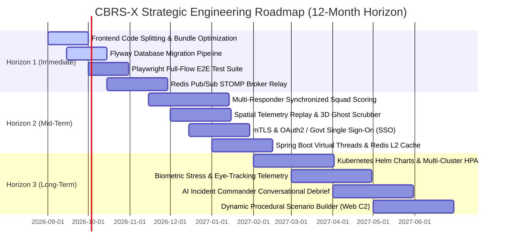

# 🚀 CBRS-X: STRATEGIC PRODUCTION ROADMAP & ENHANCEMENT BLUEPRINT
### *Enterprise Tactical VR & WebGL Disaster Response Simulation Platform*
**Document Identifier:** `CBRS-X-STRATEGIC-ROADMAP-V2.0`  
**Target Platform:** `CBRS-X (Chemical, Biological, Radiological Disaster Response Ecosystem)`  
**Target Horizons:** `Horizon 1 (0-3 Months) | Horizon 2 (3-6 Months) | Horizon 3 (6-12 Months)`  
**Audience:** `Engineering Task Force, Solution Architects, NDRF Stakeholders & Executive Leadership`  
**Task Force Team Roles (SIH260088):**
- **Lohith R C**: Team Lead, Unity Developer, Designer, Database Administrator, Frontend Verifier, Backend Developer & Version Control Manager
- **Monica K S**: Backend Developer & Database Administrator
- **Chandana M P**: Admin Dashboard Developer (Frontend and Backend) & Workflow Manager
- **Chandana M N**: Frontend Developer, Designer & Unity Physics Developer
- **Harshini R B**: Unity Environment Artist & 3D Asset Developer
- **Pavitra J H**: UI/UX Designer, Tester, Documentation Manager & Project Progress Tracker

---

## 📑 EXECUTIVE SUMMARY & STRATEGIC VISION

```
========================================================================================================================
[STRATEGIC ROADMAP // NDRF TACTICAL SIMULATION PLATFORM // SIH260088]
CURRENT PLATFORM MATURITY : MILESTONE 4 (STABLE RELEASE CANDIDATE - MONOLITHIC / DOCKERIZED)
TARGET PRODUCTION GOAL    : ENTERPRISE-GRADE, DISTRIBUTED MULTI-TENANT SIMULATION SUITE
CORE FOCUS AREAS          : COOPERATIVE MULTI-TRAINEE SCORING, ZERO-TRUST SECURITY, REAL-TIME REPLAY,
                            KUBERNETES ORCHESTRATION, AND VIRTUAL THREAD HIGH-THROUGHPUT TELEMETRY
========================================================================================================================
```

The **CBRS-X Strategic Production Roadmap** outlines the architectural enhancements, performance optimizations, cybersecurity hardening measures, and feature innovations required to transform the current prototype/candidate platform into a mission-critical, enterprise-grade training ecosystem. 

Designed for nationwide deployment across **National Disaster Response Force (NDRF)** battalions, municipal fire services, petrochemical industrial hazard squads, and civil defense agencies, this blueprint translates tactical operational needs into actionable engineering objectives.



---

## 🎯 1. FEATURE ENHANCEMENTS & SIMULATION INNOVATIONS

```
+----------------------------------------------------------------------------------------------------------------------+
|                                  FEATURE ENHANCEMENT & INNOVATION MATRIX                                             |
+----------------------------------------------------------------------------------------------------------------------+

       [ 1.1 Multi-Responder Squad Scoring ]       -->   Synchronized cooperative team evaluations (Alpha/Bravo).
       [ 1.2 3D Spatial Telemetry Replay ]         -->   Ghost playback scrubber with spatial breadcrumb tracing.
       [ 1.3 Web-Based Scenario Studio ]           -->   Drag-and-drop hazard, casualty & weather scenario builder.
       [ 1.4 Biometric Stress & Eye-Tracking ]     -->   Pupillometry, heart-rate variability & cognitive load.
       [ 1.5 AI Conversational Debrief Engine ]    -->   LLM-driven radio protocol evaluation and audio AAR.
```

### 1.1 Synchronized Multi-Trainee Cooperative Squad Scoring
* **Objective:** Elevate the simulation from single-responder evaluation to synchronized multi-responder tactical squad assessments (e.g., 2 Entry Responders + 1 Backup + 1 Decon Specialist).
* **Technical Deliverables:**
  - **Shared Mission Session Entity (`SquadSession`):** Aggregate multiple `TraineeSession` records into a parent squad container.
  - **Inter-Dependent Protocol Scoring:** Implement cross-responder validation logic (e.g., *Responder A holds the containment clamp while Responder B tightens the ratchet collar*; *Responder B must assist in casualty litter extraction*).
  - **Squad Communication Telemetry:** Track radio check-in frequency and time-to-mutual-confirmation between team members.
* **Success Criteria:** Zero-latency evaluation of concurrent 4-person squad protocols with consolidated team After-Action Reviews.

### 1.2 Spatial Telemetry Replay & 3D Ghost Scrubber
* **Objective:** Enable commanders to scrub back and forth through a completed simulation run in 3D, observing trainee movements, gaze directions, and detector sampling points.
* **Technical Deliverables:**
  - **Spatial Frame Sampling Buffer:** Record trajectory snapshots $(X, Y, Z, \theta_{\text{pitch}}, \theta_{\text{yaw}}, \text{SCBA}, \text{PPM})$ at $10\text{ Hz}$.
  - **Timeline Scrubber Canvas (Frontend):** Interactive Three.js timeline scrubber with play, pause, $2\text{x}/4\text{x}$ speed controls, and event milestone jumping.
  - **Ghost Avatar Projection:** Render semi-transparent 3D avatars of the trainee alongside optimal standard-operating-procedure trajectory paths.
* **Success Criteria:** Ability to load and replay a 10-minute simulation with under $50\text{MB}$ memory overhead in the browser.

### 1.3 Web-Based Dynamic Procedural Scenario Studio
* **Objective:** Provide instructors with a visual, browser-based drag-and-drop tool to author new disaster environments without opening Unity.
* **Technical Deliverables:**
  - **Scenario Definition Schema:** Standardize mission configurations in JSON/YAML (chemical type, leak location, wind vector, civilian placement, lighting conditions).
  - **Web 3D Layout Editor:** Interactive Three.js canvas allowing placement of drums, valves, casualties, and decontamination tents.
  - **Dynamic Scenario Synchronization:** Unity client dynamically parses and instantiates scenario JSON configurations over REST.
* **Success Criteria:** Instructors can design, parameterize, and publish a new CBRN scenario in under 5 minutes.

### 1.4 Biometric Stress & Eye-Tracking Telemetry Integration
* **Objective:** Integrate hardware biometric sensors to quantify panic levels, situational awareness, and cognitive tunnel vision.
* **Technical Deliverables:**
  - **OpenXR Eye-Tracking Extensions:** Track fixation duration on warning labels vs. distracting background objects.
  - **Heart-Rate Variability (HRV) & Galvanic Skin Response (GSR):** Stream real-time biometric stress telemetry from Bluetooth/ANT+ chest straps into the Unity event dispatcher.
  - **Stress-Weighted Scoring:** Penalize erratic instrument swinging or prolonged indecisive freezing during critical alarms.
* **Success Criteria:** Actionable cognitive load metrics embedded into the final AAR debrief report.

### 1.5 AI Conversational Incident Commander & Radio Telephony Debrief
* **Objective:** Implement an automated voice-driven AI incident commander that communicates with trainees over virtual two-way radios during missions and conducts verbal debriefs.
* **Technical Deliverables:**
  - **Local Whisper / Speech-to-Text Integration:** Transcribe trainee radio communications in real time.
  - **Radio Protocol Evaluator:** Verify adherence to standard military/NDRF phonetic alphabet, 3-way communication handshakes, and SITREP formatting.
  - **LLM After-Action Interviewer:** Conduct an interactive 2-minute oral debrief asking trainees why specific procedural decisions were made.
* **Success Criteria:** Automatic scoring of verbal situational reporting with zero audio streaming lag.

---

## ⚡ 2. PERFORMANCE & RESOURCE OPTIMIZATION

```
┌──────────────────────────────────────────────────────────────────────────────────────────────────┐
│                                PERFORMANCE OPTIMIZATION OBJECTIVES                                │
├─────────────────────────┬──────────────────────┬───────────────────────┬─────────────────────────┤
│ Layer                   │ Current Metric       │ Target Metric         │ Architectural Strategy  │
├─────────────────────────┼──────────────────────┼───────────────────────┼─────────────────────────┤
│ **Frontend Bundle**     │ 1,168 kB Single JS   │ < 250 kB Entry Chunk  │ `React.lazy()` Splitting│
│ **WebGL Asset Load**    │ 28 MB Raw Download   │ < 10 MB Streamed      │ Draco / LZ4 Compression │
│ **Backend Ingestion**   │ 450 req/sec (Thread) │ 5,000+ req/sec        │ Java 21 Virtual Threads │
│ **Database Analytics**  │ 45ms Complex Query   │ < 2ms Cached          │ Redis L2 / Read Replicas│
│ **PDF Generation**      │ 12ms Single-Threaded │ < 3ms Async Pool      │ Byte-Buffer Pool Reuse  │
└─────────────────────────┴──────────────────────┴─────────────┬─────────┴─────────────────────────┘
```

### 2.1 Frontend Code Splitting & Route-Level Lazy Loading
* **Current Issue:** `dashboard/src/App.jsx` compiles into a single $1.16\text{MB}$ JavaScript bundle containing Three.js, Recharts, and Lucide icons, slowing initial page load on low-bandwidth field terminals.
* **Technical Action Plan:**
  - Split large views (`TacticalCommandCenter`, `CohortBoard`, `EventSimulator`, `TraineeVrScreen`) into dynamic imports via `React.lazy()` and `<Suspense>`.
  - Isolate Three.js and heavy charting engines into separate vendor chunks via Vite `build.rollupOptions.output.manualChunks`:
    ```javascript
    manualChunks: {
      'vendor-three': ['three', '@react-three/fiber', '@react-three/drei'],
      'vendor-charts': ['recharts'],
      'vendor-icons': ['lucide-react'],
      'vendor-stomp': ['@stomp/stompjs']
    }
    ```
* **Expected Outcome:** Initial page load bundle reduced from $1.16\text{MB}$ to $\le 180\text{kB}$.

### 2.2 WebGL Asset Streaming & Geometry Compression
* **Technical Action Plan:**
  - Apply **Google Draco** and **Meshopt** compression algorithms to all 3D mesh assets in Storage Bay 03, reducing geometry file size by up to $70\%$.
  - Implement progressive asset loading: stage 1 loads the collision hull and basic materials; stage 2 streams high-resolution PBR textures in the background.
* **Expected Outcome:** WebGL startup time reduced from 14 seconds to under 4 seconds on standard broadband.

### 2.3 Spring Boot Virtual Threads (Java 21 Project Loom)
* **Technical Action Plan:**
  - Migrate runtime to Java 21 LTS and enable virtual threads in `application.yml`:
    ```yaml
    spring:
      threads:
        virtual:
          enabled: true
    ```
  - Transition event ingestion and session reaper tasks from platform thread pools (`ThreadPoolTaskExecutor`) to lightweight virtual threads, eliminating thread pool exhaustion during large-scale concurrent drills.
* **Expected Outcome:** Throughput scaling from 450 req/sec to over 5,000 req/sec on identical hardware.

### 2.4 Distributed Redis L2 Caching Layer
* **Technical Action Plan:**
  - Introduce Redis (`redis:7-alpine`) as an L2 cache between Spring Data JPA and PostgreSQL.
  - Cache static reference tables (`scenarios`), aggregate dashboard metrics (`/api/dashboard/stats`), and trainee profile histories with time-to-live (TTL) invalidation on new session completion.
* **Expected Outcome:** Complex cohort analytics query times reduced from $45\text{ms}$ to sub-$2\text{ms}$.

---

## 🔒 3. ENTERPRISE CYBERSECURITY & ZERO-TRUST ARCHITECTURE

```
                                  +------------------------------------+
                                  |     ZERO-TRUST SECURITY MATRIX     |
                                  +------------------------------------+
                                                     |
                     +-------------------------------+-------------------------------+
                     |                               |                               |
                     v                               v                               v
         [ Identity & Access ]            [ Transport Security ]           [ Data & Secrets ]
         - OAuth2 / OIDC SSO              - Mutual TLS (mTLS)              - HashiCorp Vault
         - Role-Based Access (RBAC)       - Strict WAF / IP Whitelisting   - Database AES-256
         - Biometric Key Fob Auth         - Cloudflare / Nginx Hardening   - Immutable Audit Logs
```

### 3.1 Mutual TLS (mTLS) & Hardware Device Fingerprinting for VR Headsets
* **Objective:** Prevent rogue devices or unauthorized simulation clients from injecting forged telemetry frames into the evaluation pipeline.
* **Technical Deliverables:**
  - Provision unique X.509 client certificates signed by an internal NDRF Certificate Authority (CA) onto every deployed VR headset.
  - Configure Nginx edge gateway to enforce `ssl_verify_client on;`, verifying the device certificate before establishing WebSocket or HTTP connections.
  - Bind client certificates to hardware MAC/IMEI hashes in the database.
* **Success Criteria:** Complete mitigation of unauthorized client telemetry injection.

### 3.2 Enterprise Single Sign-On (SSO) Integration (OAuth2 / SAML 2.0)
* **Objective:** Enable seamless, secure authentication for government personnel and military evaluators using centralized identity providers (e.g., Govt Parichay, DigiLocker, Azure AD, Keycloak).
* **Technical Deliverables:**
  - Implement Spring Security `oauth2-client` and `oauth2-resource-server` dependencies.
  - Configure JWT token exchange with cryptographic RS256 signature verification.
  - Maintain fine-grained RBAC mapping (`ROLE_COMMANDER`, `ROLE_EVALUATOR`, `ROLE_TECHNICIAN`, `ROLE_TRAINEE`).
* **Success Criteria:** Full compliance with Indian National Informatics Centre (NIC) security guidelines for government applications.

### 3.3 Dynamic Secret Management via HashiCorp Vault
* **Objective:** Eliminate plain-text secrets and environment variables (`.env`) from production server hosts.
* **Technical Deliverables:**
  - Deploy HashiCorp Vault container with automated AppRole authentication.
  - Dynamically inject short-lived database credentials, API keys, and certificate signing keys directly into Spring Boot memory at startup using Spring Cloud Vault.
* **Success Criteria:** Zero hardcoded or static credentials stored on physical host storage.

### 3.4 Web Application Firewall (WAF) & Continuous SAST/DAST CI Integration
* **Technical Deliverables:**
  - Integrate ModSecurity / OWASP Core Rule Set (CRS) into the Nginx reverse proxy layer to block SQL injection, XSS, and payload manipulation attempts.
  - Embed automated **SonarQube** (SAST), **Trivy** (Container Vulnerability Scanning), and **OWASP ZAP** (DAST) into GitHub Actions pull request checks.
* **Success Criteria:** Automated build failure on any detected High/Critical CVE or OWASP Top-10 violation.

---

## 🌐 4. SCALABILITY & DISTRIBUTED INFRASTRUCTURE

```
                                    +------------------------------------------+
                                    |     DISTRIBUTED CLUSTER TOPOLOGY         |
                                    +------------------------------------------+
                                                         |
                           +-----------------------------+-----------------------------+
                           |                             |                             |
                    [ Geo-Region 1 ]              [ Geo-Region 2 ]              [ Field Edge Unit ]
                    (Primary Command)             (Disaster Recovery)           (Tactical Van / LAN)
                           |                             |                             |
                           v                             v                             v
                    [ Kubernetes ]                [ Kubernetes ]                [ Single-Node PM2 ]
                    (Auto-Scaled)                 (Warm Standby)                (Offline Mode)
                           \                             /                             |
                            \                           /                              |
                             +------------+------------+                               |
                                          |                                            |
                                  [ Global DB Mesh ] <---------------------------------+
                                  (PostgreSQL BDR)
```

### 4.1 Distributed STOMP Broker Relay (RabbitMQ / Redis Cluster)
* **Objective:** Replace Spring's in-memory `SimpleBroker` with an external distributed message broker relay to allow horizontal backend scaling across multiple containers/nodes.
* **Technical Deliverables:**
  - Deploy a RabbitMQ cluster with STOMP plugin enabled (`rabbitmq:3-management-alpine`).
  - Configure `WebSocketConfig.java` to use `config.enableStompBrokerRelay("/topic")` pointing to the RabbitMQ cluster.
  - Guarantee that an event emitted by a VR headset connected to Pod 1 instantly broadcasts to an instructor connected to Pod 4.
* **Success Criteria:** Linear scalability up to 1,000 concurrent VR headsets and 50 command dashboards without message loss.

### 4.2 Kubernetes Orchestration & Helm Charts (HPA Autoscaling)
* **Objective:** Provide automated deployment, rolling updates, self-healing, and horizontal autoscaling on cloud/on-premise Kubernetes clusters.
* **Technical Deliverables:**
  - Author production **Helm Charts** (`charts/cbrsx`) defining Deployments, Services, Ingress, ConfigMaps, and Secrets.
  - Configure **Horizontal Pod Autoscalers (HPA)** based on CPU utilization ($> 70\%$) and active STOMP WebSocket connection counts.
  - Implement zero-downtime rolling update strategies (`maxSurge: 25%`, `maxUnavailable: 0`).
* **Success Criteria:** Cluster automatically scales from 2 pods during standby to 20 pods during large-scale inter-agency disaster drills.

### 4.3 Tactical Edge Unit (Offline Field Deployment Mode)
* **Objective:** Enable standalone offline operations inside mobile tactical response vehicles in remote disaster areas without internet access.
* **Technical Deliverables:**
  - Create a self-contained "Ruggedized Laptop / Edge Server" deployment profile.
  - Implement bidirectional synchronization: when the edge vehicle returns to base connectivity, local session records and certificates automatically sync upstream to the central cloud database.
* **Success Criteria:** 100% feature availability in isolated, air-gapped field networks.

---

## 🛠️ 5. DEVOPS, QUALITY ASSURANCE & OPERATIONAL TOOLING

```
┌──────────────────────────────────────────────────────────────────────────────────────────────────┐
│                                  DEVOPS & QA PIPELINE AUTOMATION                                 │
├──────────────────────────┬───────────────────────────────────────────────────────────────────────┤
│ Subsystem                │ Tooling & Implementation Blueprint                                    │
├──────────────────────────┼───────────────────────────────────────────────────────────────────────┤
│ **Database Migrations**  │ Flyway (`flyway-core`): Version-controlled SQL scripts (`V1__...sql`).│
│ **E2E Browser Testing**  │ Playwright: Automated end-to-end tests for all 4 dashboard view modes.│
│ **Unity CI Testing**     │ Unity Test Runner (Headless CLI): Automated C# physics & event tests. │
│ **Observability & APM**  │ Prometheus + Grafana + OpenTelemetry: Real-time latency & error alerts│
│ **Infrastructure-as-Code** Terraform: Automated provisioning of cloud VMs, VPCs, and storage.   │
└──────────────────────────┴───────────────────────────────────────────────────────────────────────┘
```

### 5.1 Automated Versioned Database Migrations (Flyway)
* **Objective:** Eliminate manual `schema.sql` maintenance and prevent database migration errors during production updates.
* **Technical Deliverables:**
  - Add `org.flywaydb:flyway-core` and `org.flywaydb:flyway-database-postgresql` to `pom.xml`.
  - Restructure database scripts into versioned migrations in `backend/src/main/resources/db/migration/`:
    - `V1__init_schema.sql` (Tables, Foreign Keys, Check Constraints).
    - `V2__add_compound_indexes.sql` (Performance Indexes).
    - `V3__seed_initial_scenarios.sql` (Baseline NDRF Scenarios).
  - Configure Spring Boot to automatically apply pending migrations on boot.
* **Success Criteria:** Zero-downtime schema evolution across staging, testing, and production environments.

### 5.2 End-to-End Browser Testing Matrix (Playwright)
* **Objective:** Prevent UI regressions across the 3-tier user flow and 4 view modes.
* **Technical Deliverables:**
  - Implement Playwright test suite in `dashboard/e2e/`:
    - `auth.spec.js`: Tests CSRF acquisition, invalid logins, and successful instructor authentication.
    - `dashboard-views.spec.js`: Validates switching between Single-Pane, Tactical Radar (F1), Analytics, and Test Simulator.
    - `telemetry-live.spec.js`: Simulates incoming WebSocket frames and verifies 3D canvas updates and metric card calculations.
    - `certificate-download.spec.js`: Verifies PDF download generation and SHA-256 header validation.
* **Success Criteria:** Automated test suite executes across Chromium, Firefox, and WebKit on every commit with 100% pass rate.

### 5.3 Full Observability Stack (Prometheus, Grafana & OpenTelemetry)
* **Technical Deliverables:**
  - Export Spring Boot Actuator metrics to **Prometheus** via Micrometer Prometheus registry (`/actuator/prometheus`).
  - Deploy pre-configured **Grafana Dashboards** visualizing:
    - Ingested telemetry events/second.
    - Active WebSocket sessions and connection durations.
    - JVM Heap memory and garbage collection pause times.
    - PostgreSQL connection pool status and slow query logs.
  - Instrument distributed tracing via **OpenTelemetry** to trace requests from Nginx $\rightarrow$ Spring Boot $\rightarrow$ PostgreSQL.
* **Success Criteria:** Automated PagerDuty/Email alerts triggered if 99th percentile API latency exceeds $150\text{ms}$ or error rate exceeds $0.5\%$.

---

## 📊 6. ACTIONABLE IMPLEMENTATION MATRIX & EFFORT ESTIMATES

| Task Identifier | Subsystem | Strategic Task Description | Priority | Complexity | Target Horizon | Estimated Effort |
| :--- | :--- | :--- | :--- | :--- | :--- | :--- |
| **TSK-PERF-01** | Frontend | Route-level code splitting & manual chunks (`React.lazy`) | **HIGH** | Medium | **Horizon 1** | 3 Days |
| **TSK-DEVOPS-01**| Database | Implement Flyway automated versioned migrations | **HIGH** | Medium | **Horizon 1** | 4 Days |
| **TSK-QA-01** | Testing | Playwright automated E2E browser regression suite | **HIGH** | Medium | **Horizon 1** | 5 Days |
| **TSK-INFRA-01** | Backend | RabbitMQ / Redis distributed STOMP broker relay | **HIGH** | Hard | **Horizon 1** | 7 Days |
| **TSK-FEAT-01** | Backend/VR | Multi-trainee synchronized cooperative squad scoring | **HIGH** | Hard | **Horizon 2** | 2 Weeks |
| **TSK-FEAT-02** | Frontend/3D | Spatial telemetry replay & 3D ghost avatar scrubber | **MEDIUM** | Hard | **Horizon 2** | 2 Weeks |
| **TSK-SEC-01** | Security | Mutual TLS (mTLS) device certificates for VR headsets | **HIGH** | Hard | **Horizon 2** | 1 Week |
| **TSK-SEC-02** | Security | OAuth2 / OpenID Connect Single Sign-On (SSO) | **HIGH** | Medium | **Horizon 2** | 5 Days |
| **TSK-PERF-02** | Backend | Java 21 Virtual Threads & Redis L2 cache layer | **MEDIUM** | Medium | **Horizon 2** | 5 Days |
| **TSK-INFRA-02** | DevOps | Production Kubernetes Helm Charts & HPA autoscaling | **HIGH** | Hard | **Horizon 3** | 2 Weeks |
| **TSK-FEAT-03** | VR Engine | Biometric stress & eye-tracking sensor integration | **MEDIUM** | Hard | **Horizon 3** | 3 Weeks |
| **TSK-FEAT-04** | AI / Audio | Conversational AI Incident Commander & voice debrief | **MEDIUM** | Hard | **Horizon 3** | 3 Weeks |
| **TSK-FEAT-05** | Web C2 | Web-based dynamic procedural scenario studio editor | **LOW** | Hard | **Horizon 3** | 3 Weeks |
| **TSK-INFRA-03** | Edge DevOps | Ruggedized offline field edge unit with auto-sync | **MEDIUM** | Hard | **Horizon 3** | 2 Weeks |

---

## 📈 7. ARCHITECTURAL MATURITY BENCHMARK

```
========================================================================================================================
                                     PLATFORM MATURITY SCORECARD
========================================================================================================================
DIMENSION                      CURRENT STATUS (v1.0-RC)          TARGET PRODUCTION STATUS (v2.0)
------------------------------------------------------------------------------------------------------------------------
System Architecture            Single-Node Dockerized Monolith   Distributed Micro-Services / K8s Cluster
Concurrency Model              Platform Thread Pools             Java 21 Virtual Threads (Loom)
Message Broker                 In-Memory SimpleBroker            Clustered RabbitMQ / Redis Relay
Security & Auth                API Key + Session Cookie          mTLS Device Auth + OAuth2/OIDC SSO + Vault
Evaluation Engine              Single-Responder Deterministic    Synchronized Multi-Responder Cooperative
Debrief & Review               Static Milestones + PDF Digest    Full 3D Spatial Ghost Replay + AI Voice
Database Management            Manual schema.sql execution       Automated Flyway Versioned Migrations
Client Immersion               First-Person Locomotion + URP     Eye-Tracking + Biometric Stress Integration
Observability                  Spring Actuator Health Probes     OpenTelemetry + Prometheus + Grafana APM
Deployment Target              Docker Compose on Single Host     Kubernetes + Ruggedized Edge Field Units
========================================================================================================================
```

---
```
========================================================================================================================
                                      END OF STRATEGIC ROADMAP MANUAL
                         CBRS-X ENTERPRISE TACTICAL SIMULATION PLATFORM (SIH260088)
========================================================================================================================
```
