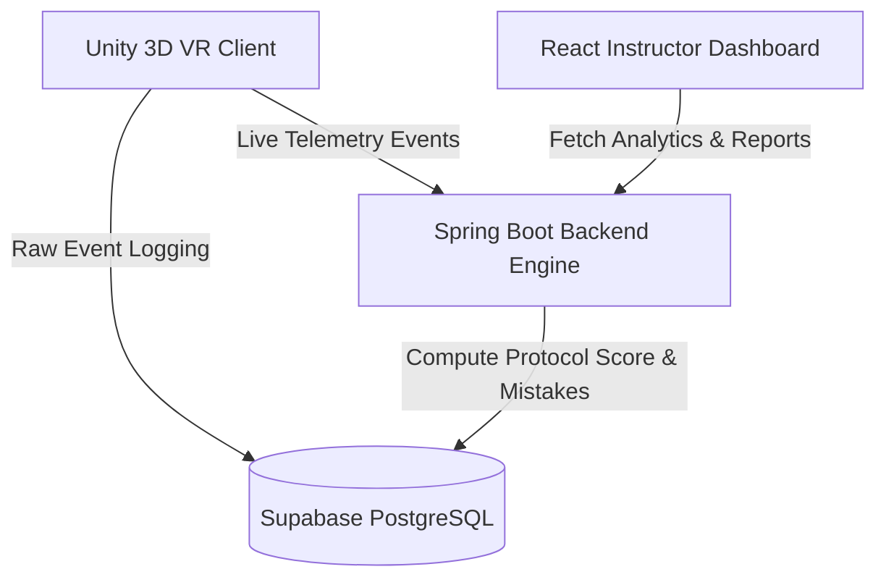

# CBRS-X — VR-Based CBRN Disaster Response Training Platform

[](https://www.sih.gov.in)
[]()
[-green.svg)]()

> **SIH260088:** A virtual reality disaster response training platform built for **NDRF (National Disaster Response Force)** personnel to practice chemical hazard neutralization, detector scanning, civilian evacuation, and decontamination protocols in realistic 3D simulated emergency environments without real-world safety risks.

---

## 🏗️ Architecture & Stack Overview



| Subsystem | Technologies Used | Description |
|---|---|---|
| **VR / 3D Simulation** | Unity, C#, XR Interaction Toolkit | Desktop 3D First-Person Responder view (VR-architected, deployable to Quest/Vive). |
| **Backend Engine** | Java 17, Spring Boot 3, Spring Data JPA | Protocol scoring engine, mistake penalty analysis, and REST API telemetry receiver. |
| **Database** | Supabase (PostgreSQL), H2 In-Memory | Relational database storing `trainees`, `scenarios`, `sessions`, and `events`. |
| **Instructor Dashboard** | React 18, Vite, Three.js, Vanilla CSS | Real-time command center UI displaying telemetry stats, pass rates, and report cards. |

---

## ⚡ Quick Start Instructions

### 1. Spring Boot Backend Service (`/backend`)
```powershell
cd backend
mvn spring-boot:run
```
Starts REST API engine at `http://localhost:8080`.

### 2. React Instructor Dashboard (`/dashboard`)
```powershell
cd dashboard
npm install
npm run dev
```
Open `http://localhost:3000` in browser.

### 3. Trainee VR Simulation (Unity)
- Open Unity Editor (`c:\Users\lohit\OneDrive\Desktop\CBRS-X`) or use the built-in 3D WebGL simulator on `http://localhost:3000`.

---

## 📜 Team Members (SIH260088)

- **Lohith R C** — Team Lead & Backend (Supabase Schema + Spring Boot Core)
- **Monica K S** — Backend (Spring Boot Validation & Scoring)
- **Chandana M N** — Unity VR / 3D Interaction Scripting
- **Harshini R B** — Environment Design & Unity Prefabs
- **Chandana M P** — Instructor Dashboard (React Frontend)
- **Pavitra J H** — UI/UX, Documentation & Testing
