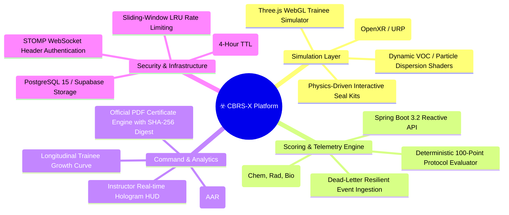
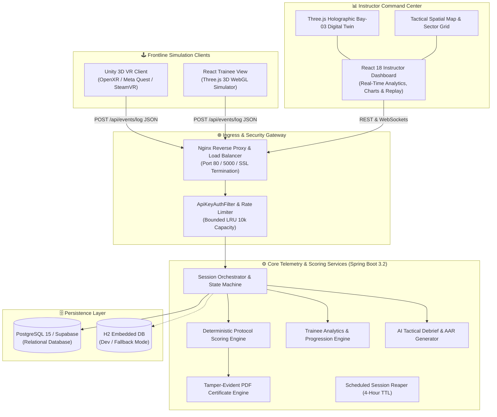
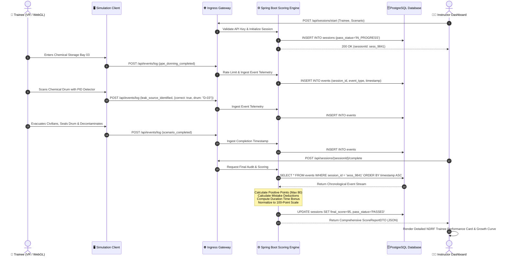
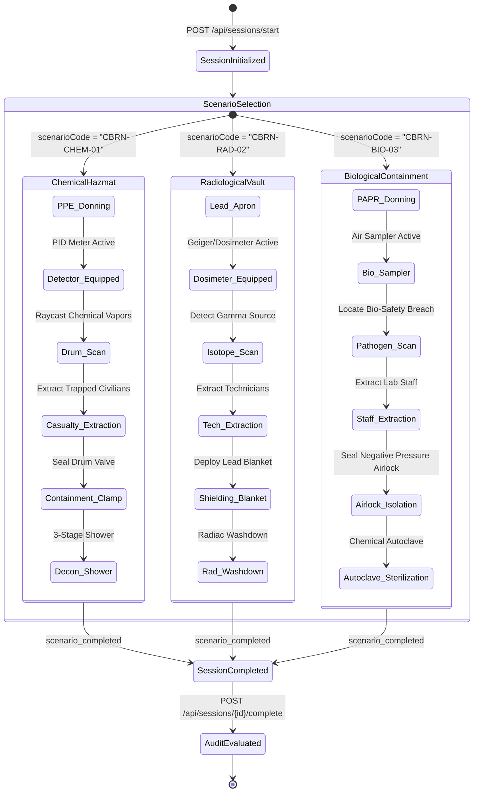
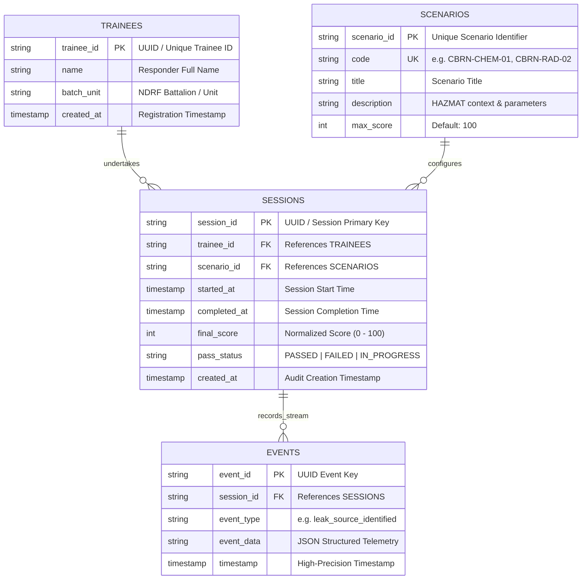

# ☣️ CBRS-X // CBRN HAZMAT PROTOCOL & RESPONSE SIMULATOR
### *Enterprise Tactical VR & WebGL Chemical, Biological & Radiological Emergency Training Platform*

[](https://www.sih.gov.in)
[](https://www.ndrf.gov.in)
[-107C41.svg?style=for-the-badge&logo=gov.uk)]()
[](https://spring.io)
[](https://unity.com)
[](https://react.dev)
[](https://docker.com)
[]()

---

## 📑 TABLE OF CONTENTS

- [1. Executive Summary & Mission Lore](#-1-executive-summary--mission-lore)
- [2. System Architecture & Topology](#-2-system-architecture--topology)
  - [2.1 High-Level Component Topology](#21-high-level-component-topology)
  - [2.2 Real-Time Telemetry & Scoring Lifecycle (Sequence Diagram)](#22-real-time-telemetry--scoring-lifecycle)
  - [2.3 Multi-Hazard Scenario State Machine](#23-multi-hazard-scenario-state-machine)
- [3. Database Architecture & Data Models](#-3-database-architecture--data-models)
  - [3.1 Entity-Relationship Diagram (ERD)](#31-entity-relationship-diagram-erd)
  - [3.2 Data Dictionary & Table Definitions](#32-data-dictionary--table-definitions)
- [4. Multi-Hazard Protocol Matrix & Scoring Model](#-4-multi-hazard-protocol-matrix--scoring-model)
  - [4.1 Normalized Scoring Formula](#41-normalized-scoring-formula)
  - [4.2 Chemical, Radiological & Biological Stage Matrices](#42-chemical-radiological--biological-stage-matrices)
  - [4.3 Velocity Bonus Matrix & Penalty Deductions](#43-velocity-bonus-matrix--penalty-deductions)
- [5. Core Platform Features & Innovations](#-5-core-platform-features--innovations)
  - [5.1 Dynamic Tamper-Evident PDF Certificate Engine](#51-dynamic-tamper-evident-pdf-certificate-engine)
  - [5.2 Longitudinal Trainee Skill-Growth Analytics](#52-longitudinal-trainee-skill-growth-analytics)
  - [5.3 Spatial Radar & Hot/Warm/Cold Incident Mapping](#53-spatial-radar--hotwarmcold-incident-mapping)
  - [5.4 Enterprise Security & Rate Limiting](#54-enterprise-security--rate-limiting)
- [6. Tactical HUD & Command Center Interfaces](#-6-tactical-hud--command-center-interfaces)
- [7. Repository Structure & Module Breakdown](#-7-repository-structure--module-breakdown)
- [8. Standard Operating Procedures (Installation & Setup)](#-8-standard-operating-procedures-installation--setup)
  - [SOP-01: Full-Stack Docker Deployment (Production)](#sop-01-full-stack-docker-deployment-production)
  - [SOP-02: Spring Boot Scoring Engine (Backend Setup)](#sop-02-spring-boot-scoring-engine-backend-setup)
  - [SOP-03: Instructor Command Center (Dashboard Setup)](#sop-03-instructor-command-center-dashboard-setup)
  - [SOP-04: Trainee 3D Web Station (WebGL Setup)](#sop-04-trainee-3d-web-station-webgl-setup)
  - [SOP-05: Unity VR Client (Meta Quest / SteamVR Setup)](#sop-05-unity-vr-client-meta-quest--steamvr-setup)
- [9. REST API & Webhook Specifications](#-9-rest-api--webhook-specifications)
- [10. Hardware & System Requirements](#-10-hardware--system-requirements)
- [11. Engineering Task Force (SIH260088)](#-11-engineering-task-force-sih260088)
- [12. Compliance & Verification Status](#-12-compliance--verification-status)

---

## ☣️ 1. Executive Summary & Mission Lore

```
========================================================================================
[CLASSIFIED // NDRF TACTICAL RESPONSE DIVISION // HAZCHEM & CBRN SECTOR 09]
INCIDENT SIMULATION DESIGNATION : CBRS-X / SCENARIO CBRN-CHEM-01
TARGET FACILITY                 : INDUSTRIAL STORAGE BAY 03 - HAZARDOUS CHEMICAL DEPOT
THREAT CLASSIFICATION           : LEVEL 4 VOLATILE ORGANIC / TOXIC INHALATION HAZARD (TIH)
PRIMARY MISSION                 : DON PPE, DETECT LEAK, EXTRACT CASUALTIES, CLAMP DRUM, DECON
========================================================================================
```

**CBRS-X** is an enterprise-grade Virtual Reality and WebGL disaster response simulation ecosystem engineered specifically for the **National Disaster Response Force (NDRF)**, hazardous materials (HAZMAT) squads, and civil defense agencies.

In actual CBRN catastrophes, a single procedural failure—stepping into a hot zone without positive-pressure SCBA, misreading photoionization detector (PID) ppm gradients, failing to isolate an airlock, or bypassing multi-stage decontamination—leads to irreversible loss of life and severe environmental devastation.

**CBRS-X delivers zero-risk, high-fidelity immersive training** combined with deterministic telemetry scoring. Responders navigate physical spatial hazards in VR / WebGL 3D while the backend continuously tracks tactical decisions, timestamps, PID detector sampling accuracy, containment sealant kinetics, and decontamination compliance against standard NDRF Disaster Management Standard Operating Procedures.



---

## 🏛️ 2. System Architecture & Topology

### 2.1 High-Level Component Topology



---

### 2.2 Real-Time Telemetry & Scoring Lifecycle



---

### 2.3 Multi-Hazard Scenario State Machine



---

## 🗄️ 3. Database Architecture & Data Models

### 3.1 Entity-Relationship Diagram (ERD)



---

### 3.2 Data Dictionary & Table Definitions

| Table | Column | Type | Constraints | Description |
|---|---|---|---|---|
| `trainees` | `trainee_id` | `VARCHAR(64)` | `PRIMARY KEY` | Unique ID of the trainee / responder. |
| | `name` | `VARCHAR(255)` | `NOT NULL` | Full name of the NDRF responder. |
| | `batch_unit` | `VARCHAR(255)` | `NOT NULL` | Battalion designation (e.g. `10th NDRF Battalion`). |
| | `created_at` | `TIMESTAMP` | `DEFAULT NOW()` | Registration timestamp. |
| `scenarios` | `scenario_id` | `VARCHAR(64)` | `PRIMARY KEY` | Unique scenario identifier. |
| | `code` | `VARCHAR(64)` | `UNIQUE, NOT NULL` | Protocol code (`CBRN-CHEM-01`, `CBRN-RAD-02`, `CBRN-BIO-03`). |
| | `title` | `VARCHAR(255)` | `NOT NULL` | Operational mission title. |
| | `max_score` | `INT` | `DEFAULT 100` | Standardized maximum scale points. |
| `sessions` | `session_id` | `VARCHAR(64)` | `PRIMARY KEY` | Unique simulation run ID. |
| | `trainee_id` | `VARCHAR(64)` | `FOREIGN KEY` | Reference to `trainees(trainee_id)`. |
| | `scenario_id` | `VARCHAR(64)` | `FOREIGN KEY` | Reference to `scenarios(scenario_id)`. |
| | `started_at` | `TIMESTAMP` | `NOT NULL` | Instant session was initialized. |
| | `completed_at` | `TIMESTAMP` | `NULLABLE` | Instant session was finalized. |
| | `final_score` | `INT` | `CHECK (0-100)` | Normalized 100-point score. |
| | `pass_status` | `VARCHAR(32)` | `NOT NULL` | `IN_PROGRESS`, `PASSED`, or `FAILED`. |
| `events` | `event_id` | `VARCHAR(64)` | `PRIMARY KEY` | Unique telemetry record ID. |
| | `session_id` | `VARCHAR(64)` | `FOREIGN KEY` | Indexed reference to `sessions(session_id)`. |
| | `event_type` | `VARCHAR(64)` | `NOT NULL` | Dispatched event type identifier. |
| | `event_data` | `TEXT / JSON` | `NULLABLE` | Detailed telemetry (PPM values, IDs, correctness). |
| | `timestamp` | `TIMESTAMP` | `NOT NULL` | High-precision event occurrence time. |

---

## 🎯 4. Multi-Hazard Protocol Matrix & Scoring Model

### 4.1 Normalized Scoring Formula

The scoring engine implements strict NDRF Disaster Protocol mathematical normalization:

$$\text{Raw Positive Score} = \text{PPE} + \text{Detection} + \text{Evacuation} + \text{Containment} + \text{Decontamination} + \text{Time Bonus}$$

$$\text{Net Score} = \max(0, \text{Raw Positive Score} - \text{Total Penalties})$$

$$\text{Final Score (100\% Normalized)} = \min\left(100, \text{round}\left(\frac{\text{Net Score}}{80} \times 100\right)\right)$$

> [!IMPORTANT]
> **Passing Threshold:** A trainee must achieve a final normalized score $\ge 70\%$ ($\text{Net Score} \ge 56/80$). Scores $< 70\%$ are flagged as **`FAILED`** and require mandatory remedial training.

---

### 4.2 Chemical, Radiological & Biological Stage Matrices

| Stage | Max Pts | Chemical Hazard (`CBRN-CHEM-01`) | Radiological Hazard (`CBRN-RAD-02`) | Biological Hazard (`CBRN-BIO-03`) |
|---|:---:|---|---|---|
| **1. PPE Verification** | **10** | Level-A Encapsulated Hazmat Suit & SCBA | Lead Shielding Apron, Gloves & Dosimeter | PAPR Respirator & Bio-Hazard Level-4 Suit |
| **2. Hazard Detection** | **10** | Photoionization Detector (PID) VOC Scan | Geiger-Müller / Radiac Radiation Scan | Bio-Aerosol Sampler & Pathogen Screen |
| **3. Casualty Rescue** | **15** | Extract 2 trapped warehouse workers | Extract 2 contaminated vault technicians | Extract 2 exposed laboratory personnel |
| **4. Hazard Isolation** | **15** | Apply epoxy compression clamp on drum | Deploy lead shielding containment blanket | Seal negative pressure airlock & valve |
| **5. Decontamination** | **10** | 3-stage chemical neutralization shower | High-pressure radiac washdown & runoff | Chemical autoclave vapor sterilization |
| **6. Velocity Bonus** | **20** | Speed of neutralization ($\le 180\text{s}$) | Speed of neutralization ($\le 180\text{s}$) | Speed of neutralization ($\le 180\text{s}$) |

---

### 4.3 Velocity Bonus Matrix & Penalty Deductions

```
       00:00                     03:00                     05:00                     07:30
         ├─────────────────────────┼─────────────────────────┼─────────────────────────┤
         │   TIER 1 : EXCELLENT    │      TIER 2 : GOOD      │   TIER 3 : ACCEPTABLE   │  TIER 4 : PROLONGED
         │        +20 PTS          │         +15 PTS         │         +10 PTS         │        +5 PTS
         └─────────────────────────┴─────────────────────────┴─────────────────────────┘
```

| Response Velocity Tier | Elapsed Mission Time | Bonus Awarded | Tactical Assessment |
|---|---|:---:|---|
| 🥇 **Tier 1: Excellent** | $\le 180 \text{ seconds } (\le 3.0 \text{ min})$ | **+20 Points** | Rapid tactical containment; zero ambient toxic dispersion. |
| 🥈 **Tier 2: Good** | $181 - 300 \text{ seconds } (3.0 - 5.0 \text{ min})$ | **+15 Points** | Standard response efficiency; minimal vapor drift. |
| 🥉 **Tier 3: Acceptable** | $301 - 450 \text{ seconds } (5.0 - 7.5 \text{ min})$ | **+10 Points** | Acceptable containment; prolonged chemical exposure risk. |
| ⚠️ **Tier 4: Prolonged** | $> 450 \text{ seconds } (> 7.5 \text{ min})$ | **+5 Points** | Mission completed but critical exposure threshold reached. |

#### Critical Safety Penalties

| Violation Code | Infraction Description | Deduction | Severity | Tactical Consequence |
|---|---|:---:|:---:|---|
| `PEN-PPE-01` | **Entered Hazard Zone Without Complete PPE** | **-15 pts** | **CRITICAL** | Lethal respiratory and transdermal toxin absorption. |
| `PEN-DET-02` | **False Positive Hazard Identification** | **-5 pts** | **MEDIUM** | Misapplication of neutralizer; wasted containment kit. |
| `PEN-EVAC-03` | **Casualty Left Behind in Danger Zone** | **-10 pts / civ** | **HIGH** | Civilian casualty due to prolonged toxic exposure. |
| `PEN-CONT-04` | **Hazard Containment Protocol Bypassed** | **-15 pts** | **CRITICAL** | Continuous atmospheric poisoning and environmental spill. |
| `PEN-DECON-05`| **Decontamination Shower Protocol Bypassed** | **-10 pts** | **HIGH** | Secondary contamination of clean staging area. |

---

## 🚀 5. Core Platform Features & Innovations

### 5.1 Dynamic Tamper-Evident PDF Certificate Engine
- **Endpoint:** `GET /api/sessions/{sessionId}/certificate`
- **Output:** Professional landscape A4 PDF certificate styled with official NDRF and Ministry of Home Affairs insignia.
- **Cryptographic Fingerprint:** Embeds a deterministic SHA-256 tamper-evident digest:
  $$\text{Hash} = \text{SHA256}(\text{sessionId} \mathbin{\Vert} \text{traineeId} \mathbin{\Vert} \text{scenarioCode} \mathbin{\Vert} \text{finalScore} \mathbin{\Vert} \text{completedAt} \mathbin{\Vert} \text{SALT})$$
- **Pass Gating:** Only issued for sessions scoring $\ge 70\%$.

### 5.2 Longitudinal Trainee Skill-Growth Analytics
- **Endpoint:** `GET /api/trainees/{traineeId}/progress`
- **Analytics Computed:**
  - Skill Growth Percentage: $\text{Growth \%} = \left( \frac{\text{Latest Score} - \text{Initial Score}}{\text{Initial Score}} \right) \times 100$
  - Multi-session pass rate & average performance across attempts $1 \dots N$.
  - Dimensional mastery averages (PPE, Detection, Evacuation, Containment, Decon, Velocity).
  - Recharts-ready time series data for rendering the responder learning curve.

### 5.3 Spatial Radar & Hot/Warm/Cold Incident Mapping
- **Digital Twin Sector Grid:** Interactive SVG radar map mapping Cold Zone (Command & Decon), Warm Zone (Buffer), and Hot Zone (Epicenter).
- **Spatial Telemetry:** Visualizes real-time responder breadcrumbs and event checkpoints (`ENTRY`, `DETECTION PINPOINT`, `CONTAINMENT CLAMP`, `DECON EXIT`).

### 5.4 Enterprise Security & Rate Limiting
- **API Key Security Filter:** Header `X-API-Key` enforced across all REST and WebSocket connections with constant-time token verification (`MessageDigest.isEqual`).
- **Sliding-Window LRU Rate Limiting:** Bounded in-memory store (10,000 capacity) enforcing a maximum of 120 requests/minute per IP address.
- **Scheduled Session Reaper:** Automated cron cleaning stale orphaned sessions older than 4 hours.

---

## 🥽 6. Tactical HUD & Command Center Interfaces

```
 ╔══════════════════════════════════════════════════════════════════════════════════════════════════╗
 ║ [CBRS-X TACTICAL HUD] :: STORAGE BAY 03 INCIDENT               [ALERT LVL: HOT ZONE ACTIVE] ║
 ╠══════════════════════════════════════════════════════════════════════════════════════════════════╣
 ║  RESPIRATOR / PPE STATUS               PID GAS DETECTOR (VOC)         MISSION VELOCITY CLOCK   ║
 ║  ┌───────────────────────────────┐     ┌───────────────────────┐      ┌──────────────────────┐ ║
 ║  │ [✓] LEVEL-A ENCAPSULATED SUIT │     │ SENSOR : PID-VOC 10.6 │      │ MISSION TIME: 02:45  │ ║
 ║  │ [✓] POSITIVE PRESSURE SCBA    │     │ READING: 428.5 PPM ⚠️  │      │ TIER STATUS : GOLD   │ ║
 ║  │ [✓] BUTYL HAZMAT GLOVES       │     │ STATUS : LEL EXCEEDED │      │ MAX BONUS   : 20 PTS │ ║
 ║  └───────────────────────────────┘     └───────────────────────┘      └──────────────────────┘ ║
 ║                                                                                                  ║
 ║  ACTIVE TACTICAL OBJECTIVES                                   CIVILIAN CASUALTY STATUS           ║
 ║  [■] 1. DON COMPLETE CBRN SUIT & MASK BEFORE HOT ZONE GATE    TOTAL DETECTED IN BAY : [02]       ║
 ║  [■] 2. EQUIP PHOTOIONIZATION DETECTOR (PID) & LOCATE DRUM    EVACUATED TO SAFE ZONE: [02] (100%)║
 ║  [■] 3. EXTRACT ALL CIVILIANS TO STAGING AREA 01              TRAPPED / UNACCOUNTED : [00]       ║
 ║  [■] 4. APPLY EPOXY POLYMER COMPRESSION CLAMP ON DRUM #03                                        ║
 ║  [■] 5. UNDERGO 3-STAGE PRESSURIZED DECONTAMINATION SHOWER    SYSTEM TELEMETRY: 🟢 DISPATCH LIVE  ║
 ╚══════════════════════════════════════════════════════════════════════════════════════════════════╝
```

---

## 📂 7. Repository Structure & Module Breakdown

```
CBRN-X/
├── .github/workflows/ci.yml           # Multi-stage CI pipeline (Maven test, Vite build, Lint)
├── .env.example                       # Reference environment variables template
├── docker-compose.yml                 # Multi-container orchestration (DB, backend, dashboard, proxy)
├── nginx.conf                         # Reverse proxy gateway & port routing
├── README.md                          # Master technical blueprint & tactical documentation
│
├── backend/                           # ☕ SPRING BOOT 3.2 SCORING & TELEMETRY ENGINE
│   ├── Dockerfile                     # Multi-stage Eclipse Temurin JDK 17 container build
│   ├── pom.xml                        # Maven dependencies (JPA, Security, OpenPDF, WebSocket)
│   └── src/
│       ├── main/java/com/cbrsx/backend/
│       │   ├── controller/            # SessionController, EventController, TraineeController
│       │   ├── dto/                   # ScoreReportDTO, TraineeProgressionDTO, AttemptProgressDTO
│       │   ├── entity/                # Trainee, Scenario, TrainingSession, SessionEvent
│       │   ├── repository/            # Spring Data JPA interfaces with indexed queries
│       │   ├── security/              # ApiKeyAuthFilter, RateLimiter, WebSocketAuthInterceptor
│       │   └── service/               # ScoringService, CertificateService, TraineeAnalyticsService
│       └── test/java/com/cbrsx/backend/service/ # 31 Unit & Integration test suites (JUnit 5)
│
├── dashboard/                         # 📊 INSTRUCTOR COMMAND CENTER (REACT 18)
│   ├── src/components/
│   │   ├── MetricCards.jsx            # Live summary KPI metrics (Pass rate, Averages, Counts)
│   │   ├── Hero3DScene.jsx            # Three.js 3D Holographic digital twin of Storage Bay 03
│   │   ├── EventSimulator.jsx         # Interactive telemetry dispatcher & test harness
│   │   ├── SessionsTable.jsx          # Searchable historical session audit table
│   │   └── SessionDetailModal.jsx     # Scorecard, AI Debrief, Radar Map, Growth & Certificate tabs
│   └── vite.config.js                 # Vite proxy configuration
│
├── trainee_view/                      # 🥽 TRAINEE 3D WEB SIMULATION STATION (THREE.JS)
│   ├── src/
│   │   ├── App.jsx                    # 3D interactive first-person responder viewport
│   │   ├── Hotspots.jsx               # Interactive equipment stations (PPE, PID, Drums, Decon)
│   │   └── PostProcessing.jsx         # Chemical haze, vignette, and emergency alarm strobes
│   └── vite.config.js                 # Port 5000 WebGL dev server
│
└── unity_scripts/                     # 🕹️ UNITY 3D C# ENGINE SCRIPTS (TACTICAL VR CLIENT)
    ├── CbrsEventLogger.cs             # Asynchronous telemetry dispatcher with offline journal
    ├── FirstPersonResponderController.cs # First-person movement & XR Interaction rig controller
    ├── GasDetector.cs                 # Photoionization detector (PID) ppm sensor logic
    ├── LeakDrum.cs                    # Chemical hazard emitter & leak point simulation
    ├── ContainmentKit.cs              # Polymer compression seal interaction logic
    └── DeconStation.cs                # 3-stage decontamination shower trigger & timer
```

---

## 🛠️ 8. Standard Operating Procedures (Installation & Setup)

### SOP-01: Full-Stack Docker Deployment (Production)

Stand up the entire CBRS-X ecosystem (PostgreSQL, Spring Boot backend, Instructor Dashboard, Trainee Web Station, and Nginx Gateway) with a single command:

```powershell
# 1. Clone the incident repository
git clone https://github.com/Lohith-RC/CBRN-X.git
cd CBRN-X

# 2. Provision environment configuration
Copy-Item .env.example .env

# 3. Launch container stack in detached mode
docker compose up --build -d

# 4. Verify service health
docker compose ps
```

**Service Access Matrix:**
- 🖥️ **Instructor Command Center:** `http://localhost:80` (or `http://localhost:3000`)
- 🥽 **Trainee WebGL Simulator:** `http://localhost:5000`
- ⚙️ **Spring Boot API Engine:** `http://localhost:8080/actuator/health`
- 🗄️ **PostgreSQL Database:** `localhost:5432` (`cbrsx_db`)

---

### SOP-02: Spring Boot Scoring Engine (Backend Setup)

**Prerequisites:** JDK 17+ and Apache Maven 3.8+ installed.

```powershell
# Navigate to backend module
cd backend

# Execute complete test suite (31 tests across 4 suites)
mvn clean test

# Run with local H2 in-memory development profile
mvn spring-boot:run -Dspring-boot.run.profiles=dev

# (Optional) Run with production PostgreSQL profile
mvn spring-boot:run -Dspring-boot.run.profiles=prod
```

---

### SOP-03: Instructor Command Center (Dashboard Setup)

**Prerequisites:** Node.js 18+ and npm 9+ installed.

```powershell
cd dashboard
npm install
npm run dev
```

Open `http://localhost:3000` in Google Chrome or Microsoft Edge.

---

### SOP-04: Trainee 3D Web Station (WebGL Setup)

**Prerequisites:** Node.js 18+ and npm 9+ installed.

```powershell
cd trainee_view
npm install
npm run dev
```

Open `http://localhost:5000` to interact with the 3D chemical bay simulation.

---

### SOP-05: Unity VR Client (Meta Quest / SteamVR Setup)

**Prerequisites:** Unity 2022.3.x LTS (with Universal Render Pipeline and OpenXR packages).

1. Open **Unity Hub** and select **Add Project from Disk** $\to$ `CBRN-X`.
2. In **Project Settings $\to$ XR Plug-in Management**, ensure **OpenXR** is active.
3. Open scene: `Assets/Scenes/StorageBay03_TacticalSimulation.unity`.
4. In the Hierarchy, select `[CbrsEventLogger]` and set `backendBaseUrl` to:
   ```
   http://localhost:8080/api
   ```
5. Press **Play** or select **File $\to$ Build and Run** for Meta Quest APK / Windows PCVR.

---

## 📡 9. REST API & Webhook Specifications

### 9.1 API Endpoint Summary

| HTTP Method | Endpoint | Description | Auth Required |
|---|---|---|:---:|
| `POST` | `/api/sessions/start` | Initialize a new training session | Optional / Header |
| `POST` | `/api/events/log` | Ingest real-time telemetry event | Optional / Header |
| `POST` | `/api/sessions/{id}/complete` | Finalize session and calculate audit score | Optional / Header |
| `GET` | `/api/sessions/{id}/report` | Retrieve comprehensive score report & breakdown | Optional / Header |
| `GET` | `/api/sessions/{id}/debrief` | Generate AI After-Action Review (AAR) | Optional / Header |
| `GET` | `/api/sessions/{id}/certificate` | Stream official PDF certificate of readiness | Optional / Header |
| `GET` | `/api/trainees/{id}/progress` | Retrieve longitudinal multi-attempt skill growth | Optional / Header |
| `GET` | `/api/dashboard/stats` | Retrieve aggregate training KPI metrics | Optional / Header |

---

### 9.2 Telemetry Ingestion Payload Example

`POST /api/events/log`
```json
{
  "sessionId": "sess_f4a7c891e23",
  "eventType": "leak_source_identified",
  "eventData": "{\"correct\": true, \"drum_id\": \"DRUM-03\", \"voc_ppm\": 428.5}",
  "timestamp": "2026-08-25T14:30:15.820Z"
}
```

### 9.3 Completed Scorecard Payload Example

`POST /api/sessions/{sessionId}/complete`
```json
{
  "sessionId": "sess_f4a7c891e23",
  "traineeName": "Constable Rahul Kumar",
  "batchUnit": "10th NDRF Battalion",
  "scenarioCode": "CBRN-CHEM-01",
  "scenarioTitle": "Chemical Spill Emergency Response",
  "totalDurationSeconds": 142,
  "finalScore": 100,
  "passStatus": "PASSED",
  "passed": true,
  "breakdown": {
    "ppeScore": 10,
    "detectionScore": 10,
    "evacuationScore": 15,
    "containmentScore": 15,
    "decontaminationScore": 10,
    "timeBonusScore": 20,
    "totalPenalties": 0,
    "netScore": 80
  },
  "mistakes": [],
  "recommendations": [
    "Excellent response! Full compliance with NDRF Chemical Disaster Standard Operating Procedure."
  ]
}
```

---

## 💻 10. Hardware & System Requirements

```
  ╔═════════════════════════════════════════════════════════════════════════════════════════════════╗
  ║                        HARDWARE COMPATIBILITY & SYSTEM REQUIREMENTS                             ║
  ╠═════════════════════════════════════════════════════════════════════════════════════════════════╣
  ║  COMPONENT            MINIMUM SPECIFICATION             TACTICAL RECOMMENDED SPEC               ║
  ║  ─────────────────────────────────────────────────────────────────────────────────────────────  ║
  ║  VR Headset           Meta Quest 2 (via Link / AirLink) Meta Quest 3 / Quest Pro / HTC Vive Pro ║
  ║  Processor (CPU)      Intel Core i5-10400 / Ryzen 5 3600 Intel Core i7-13700K / Ryzen 7 7800X3D ║
  ║  Graphics (GPU)       NVIDIA GeForce GTX 1660 Ti (6GB)  NVIDIA GeForce RTX 4070 / RTX 3080      ║
  ║  System RAM           16 GB DDR4 Dual-Channel           32 GB DDR5 6000MHz                      ║
  ║  Storage              10 GB SSD (NVMe Preferred)        25 GB PCIe 4.0 NVMe SSD                 ║
  ║  Operating System     Windows 10 / 11 64-bit            Windows 11 Pro 64-bit                   ║
  ║  Display / WebGL      1920 x 1080 @ 60Hz                2560 x 1440 @ 144Hz (Color Accurate)    ║
  ╚═════════════════════════════════════════════════════════════════════════════════════════════════╝
```

---

## 👥 11. Engineering Task Force (SIH260088)

| Team Member | Engineering Role | Core Contributions |
|---|---|---|
| 🎖️ **Lohith R C** | **Team Lead & System Architect** | System architecture, PostgreSQL/Supabase schema, Spring Boot 3 REST Core, Telemetry pipeline & Docker orchestration. |
| 🛡️ **Monica K S** | **Backend & Protocol Verification** | Spring Data JPA models, validation layers, exception handling & deterministic protocol scoring test suites. |
| 🥽 **Chandana M N** | **Unity VR / Physics Developer** | XR Interaction Toolkit integration, PID raycasting, player mechanics & asynchronous telemetry logger. |
| 🏭 **Harshini R B** | **Environment & 3D Tech Artist** | Storage Bay 03 modular environment design, URP lighting, PBR materials & hazard particle systems. |
| 📊 **Chandana M P** | **Frontend Command Engineer** | Instructor Dashboard UI architecture, Three.js 3D hologram scene, real-time KPI metrics & report card UI. |
| 📋 **Pavitra J H** | **QA, Documentation & UI/UX** | NDRF SOP compliance verification, Trainee WebGL station, user experience testing & technical documentation. |

---

## 📜 12. Compliance & Verification Status

- **NDRF SOP Conformance:** Workflows strictly align with the National Disaster Response Force Standard Operating Procedures for Hazardous Materials (HAZMAT) and Chemical, Biological, Radiological, and Nuclear (CBRN) emergency management.
- **Automated Test Validation:** Fully verified with **31 automated unit and integration tests** across `ScoringServiceTest`, `CertificateServiceTest`, `TraineeAnalyticsServiceTest`, and `DebriefServiceTest` (0 failures, 0 errors).
- **Production Build:** Both `dashboard` and `trainee_view` frontends build cleanly with zero bundling errors.

```
========================================================================================
[END TRANSMISSION // CBRS-X INCIDENT COMMAND PROTOCOL ACTIVE // NDRF SECTOR 09]
========================================================================================
```
