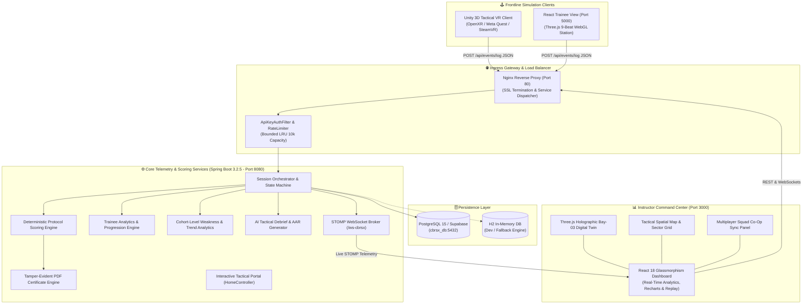
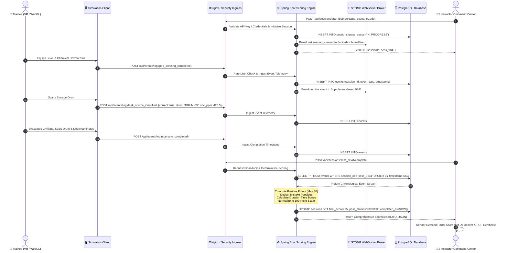
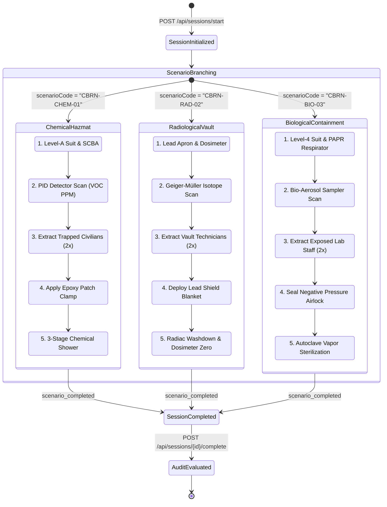
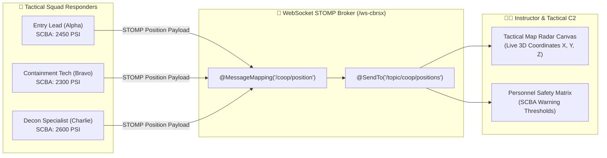
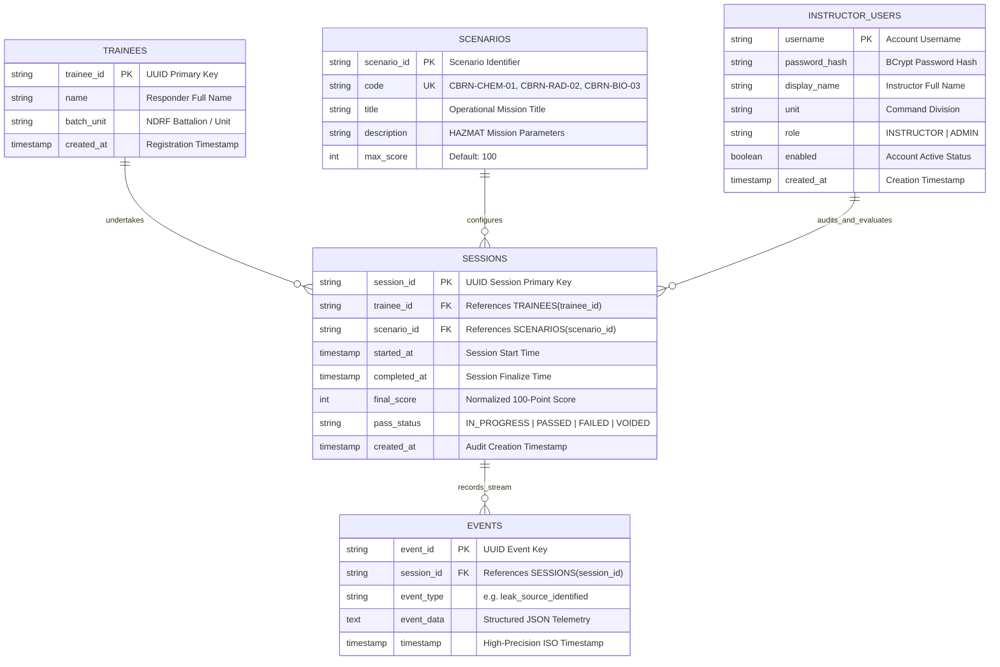
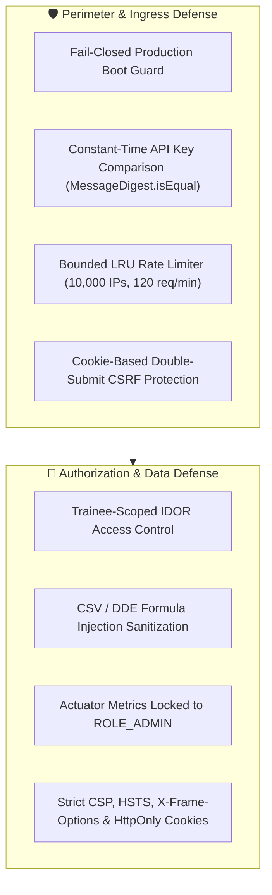

# ☣️ CBRS-X // CBRN HAZMAT PROTOCOL & RESPONSE SIMULATOR
### *Enterprise Tactical VR & WebGL Chemical, Biological & Radiological Emergency Training Platform*

<div align="center">

[](https://www.sih.gov.in)
[](https://www.ndrf.gov.in)
[-138808.svg?style=for-the-badge&logo=gov.uk&logoColor=white)](https://mha.gov.in)
[](https://kit-tpt.ac.in)

[](https://spring.io)
[](https://unity.com)
[](https://react.dev)
[](https://postgresql.org)
[](https://docker.com)
[]()

</div>

---

```
========================================================================================================================
[CLASSIFIED // NDRF TACTICAL RESPONSE DIVISION // HAZCHEM & CBRN SECTOR 09]
INCIDENT SIMULATION DESIGNATION : CBRS-X / SCENARIO CBRN-CHEM-01 / CBRN-RAD-02 / CBRN-BIO-03
TARGET OPERATIONAL FACILITY     : INDUSTRIAL STORAGE BAY 03 - HAZARDOUS MATERIAL & ISOTOPE DEPOT
THREAT CLASSIFICATION           : LEVEL 4 VOLATILE ORGANIC / RADIOLOGICAL DISPERSION / AIRBORNE BIO-HAZARD
PRIMARY MISSION CYCLE           : DETECT ➔ PROTECT (PPE) ➔ CONTAIN ➔ EVACUATE ➔ DECONTAMINATE
TELEMETRY & SCORING STATUS      : SPRING BOOT 3.2 DETERMINISTIC AUDIT ENGINE [ACTIVE // PORT 8080]
========================================================================================================================
```

---

## 📑 Master Table of Contents

- [1. 🛡️ Executive Summary & Mission Lore](#1-️-executive-summary--mission-lore)
- [2. 🏛️ System Architecture & Multi-Tier Topology](#2-️-system-architecture--multi-tier-topology)
  - [2.1 High-Level Component Topology](#21-high-level-component-topology)
  - [2.2 Real-Time Telemetry & Scoring Lifecycle (Sequence Flow)](#22-real-time-telemetry--scoring-lifecycle)
  - [2.3 Multi-Hazard Polymorphic Scenario State Machine](#23-multi-hazard-polymorphic-scenario-state-machine)
  - [2.4 Multiplayer Squad Co-Op Telemetry Sync Architecture](#24-multiplayer-squad-co-op-telemetry-sync-architecture)
- [3. 🥽 Frontline Simulation Clients (VR & WebGL 3D)](#3--frontline-simulation-clients-vr--webgl-3d)
  - [3.1 Trainee 3D Web Station (9-Beat Phase 1 Narrative Engine)](#31-trainee-3d-web-station-9-beat-phase-1-narrative-engine)
  - [3.2 Unity 2022.3 Tactical VR Client (OpenXR / URP)](#32-unity-20223-tactical-vr-client-openxr--urp)
- [4. 🖼️ Visual Simulation Showcase & Bay 03 Gallery](#4-️-visual-simulation-showcase--bay-03-gallery)
  - [4.1 Establishing & Overhead Catwalk Angles](#41-establishing--overhead-catwalk-angles)
  - [4.2 Interactive Hazardous Equipment Stations](#42-interactive-hazardous-equipment-stations)
  - [4.3 First-Person Responder Action Perspectives](#43-first-person-responder-action-perspectives)
- [5. 🗄️ Database Architecture & Data Models](#5-️-database-architecture--data-models)
  - [5.1 Entity-Relationship Diagram (ERD)](#51-entity-relationship-diagram-erd)
  - [5.2 Data Dictionary & Table Definitions](#52-data-dictionary--table-definitions)
- [6. 🎯 Multi-Hazard Protocol Matrix & Scoring Model](#6--multi-hazard-protocol-matrix--scoring-model)
  - [6.1 Normalized Scoring Formula](#61-normalized-scoring-formula)
  - [6.2 Stage Matrices: Chemical, Radiological & Biological](#62-stage-matrices-chemical-radiological--biological)
  - [6.3 Velocity Bonus Matrix & Critical Safety Penalties](#63-velocity-bonus-matrix--critical-safety-penalties)
- [7. 📊 Instructor Tactical Command Center & Analytics](#7--instructor-tactical-command-center--analytics)
- [8. 📜 Dynamic Tamper-Evident PDF Certificate Engine](#8--dynamic-tamper-evident-pdf-certificate-engine)
- [9. 🔒 Enterprise Security & Threat Model Hardening](#9--enterprise-security--threat-model-hardening)
- [10. 📡 REST API & STOMP WebSocket Specifications](#10--rest-api--stomp-websocket-specifications)
- [11. 🕹️ Unity C# Tactical Architecture & Physics Models](#11-️-unity-c-tactical-architecture--physics-models)
- [12. 🛠️ Standard Operating Procedures (Installation & Setup)](#12-️-standard-operating-procedures-installation--setup)
- [13. 👥 Engineering Task Force (SIH260088)](#13--engineering-task-force-sih260088)
- [14. 📜 Compliance & Verification Status](#14--compliance--verification-status)

---

## 1. 🛡️ Executive Summary & Mission Lore

**CBRS-X** is an enterprise-grade Virtual Reality and WebGL disaster response simulation ecosystem engineered specifically for the **National Disaster Response Force (NDRF)**, hazardous materials (HAZMAT) squads, petrochemical emergency units, and civil defense agencies under **SIH Problem Statement SIH260088**.

In real-world CBRN disasters, a single procedural infraction—stepping into a hot zone without positive-pressure SCBA, misinterpreting photoionization detector (PID) ppm gradients, failing to isolate an airlock, or bypassing multi-stage decontamination—causes catastrophic contamination, permanent physical injury, or loss of human life.

**CBRS-X provides zero-risk, high-fidelity immersive tactical training** paired with a deterministic telemetry scoring engine. First responders navigate hazardous industrial environments in VR / WebGL 3D while the backend continuously audits tactical decisions, timestamps, PID detector sampling accuracy, containment sealant kinetics, and decontamination compliance against standard NDRF Standard Operating Procedures.

```mermaid
mindmap
  root((☣️ CBRS-X Platform))
    Simulation Layer
      Unity 2022.3 LTS VR Client (OpenXR / URP)
      Three.js WebGL Trainee Simulator (9-Beat Engine)
      Volumetric Gaussian Plume Dispersion Shaders
      Physics-Driven Interactive Seal Kits & Decon Archway
    Scoring & Telemetry Engine
      Spring Boot 3.2.5 Reactive Telemetry Ingestion
      Deterministic 100-Point Protocol Evaluator
      Multi-Hazard Polymorphic Logic (Chem, Rad, Bio)
      Dead-Letter Resilient Event Ingestion Queue
    Command & Analytics
      Instructor Real-time Hologram HUD & Tactical Grid
      Longitudinal Trainee Skill-Growth Learning Curve
      Automated AI After-Action Review (AAR) Debrief
      Official PDF Certificate Engine with SHA-256 Digest
    Security & Infrastructure
      PostgreSQL 15 / Supabase Persistent Storage
      STOMP WebSocket Header Authentication
      Sliding-Window LRU Rate Limiting (10k IP Bounded)
      DDE / CSV Formula Injection Sanitization Guard
```

---

## 2. 🏛️ System Architecture & Multi-Tier Topology

### 2.1 High-Level Component Topology



---

### 2.2 Real-Time Telemetry & Scoring Lifecycle



---

### 2.3 Multi-Hazard Polymorphic Scenario State Machine



---

### 2.4 Multiplayer Squad Co-Op Telemetry Sync Architecture



---

## 3. 🥽 Frontline Simulation Clients (VR & WebGL 3D)

### 3.1 Trainee 3D Web Station (9-Beat Phase 1 Narrative Engine)

The Trainee Web Station (`http://localhost:5000`) delivers an interactive, high-fidelity first-person simulation built with **React 18**, **Three.js**, and a seamless dual-video crossfade engine mapped to 9 distinct tactical beats (0:00 – 1:03):

```
 0:00               0:14               0:28               0:42               0:56        1:03
  ├──────────────────┼──────────────────┼──────────────────┼──────────────────┼────────────┤
  │ BEAT 1 - BEAT 2  │ BEAT 3 - BEAT 4  │ BEAT 5 - BEAT 7  │      BEAT 8      │   BEAT 9   │
  │ CCTV Breach &    │ Console Blowout  │ Hazmat Suit,     │ Advance to Gate  │ Equip PID  │
  │ Safety Orient    │ & PPE Table Lock │ Mask & Gloves    │ Hot Zone Breach  │ Spectrometer
  └──────────────────┴──────────────────┴──────────────────┴──────────────────┴────────────┘
```

| Beat ID | Time Range | Scenario Stage & Interactive Objective | Visual FX & Audio Shader | Dispatched Telemetry Event |
|---|:---:|---|---|---|
| **BEAT_1** | `0:00–0:07` | **CCTV Surveillance & Breach:** Monitor exterior CCTV feed during secondary tank explosion. | CCTV Scanlines, Chromatic Aberration | `scenario_started` |
| **BEAT_2** | `0:07–0:14` | **First-Person Init & Safety Check:** Assess perimeter hazard signs. Do not cross without gear. | First-Person HUD Boot sweep line | `trainee_heartbeat` |
| **BEAT_3** | `0:14–0:21` | **Environmental Hazard Scan:** Inspect damaged terminal displaying toxic spike (>400 PPM). | Electrical Spark Flash, Alarm Strobe | `ppm_reading_taken` |
| **BEAT_4** | `0:21–0:28` | **Protocol Navigation & Target Lock:** Approach stainless steel decontamination staging table. | Tactical Reticle Target Lock | `approached_ppe_station` |
| **BEAT_5** | `0:28–0:35` | **PPE Donning (Hazmat Suit):** Click to zip central torso seal of Level-A chemical suit. | Chemical Haze Tinting | `ppe_item_equipped (suit)` |
| **BEAT_6** | `0:35–0:42` | **PPE Donning (CBRN Mask):** Snap CBRN full-face respirator visor over eyes and mouth. | Visor Overlay, Breathing Fog Shader | `ppe_item_equipped (mask)` |
| **BEAT_7** | `0:42–0:49` | **PPE Donning (Gloves & Clearance):** Secure butyl chemical-resistant gloves. Full clearance granted. | HUD Status: `PPE ACTIVE (100%)` | `ppe_donning_completed` |
| **BEAT_8** | `0:49–0:56` | **Advance to Hazard Perimeter:** Sprint past blast gates into the Storage Bay 03 hot zone. | Sprint Motion Blur, Atmospheric Fog | `entered_bay_03` |
| **BEAT_9** | `0:56–1:03` | **Multi-Gas Detector Acquisition:** Equip handheld PID detector; needle unlocks at 12.4 PPM. | OLED Matrix HUD, Geiger Tick Audio | `detector_equipped` |

---

### 3.2 Unity 2022.3 Tactical VR Client (OpenXR / URP)

The standalone Unity simulation client delivers a fully immersive tactical virtual reality experience optimized for **Meta Quest 2/3**, **Meta Quest Pro**, and **SteamVR / PCVR**:

- **OpenXR Interaction Toolkit:** Ergonomic two-handed grab mechanics for PID detectors, epoxy containment kits, and casualty stretchers.
- **Volumetric Gaussian Plume Dispersion:** Dynamic inverse-square chemical diffusion shaders modeling wind vector drift, turbulence decay, and temperature dissipation.
- **Resilient Asynchronous Event Dispatcher (`CbrsEventLogger.cs`):** FIFO event queue with exponential backoff retry policy, offline journal caching, and microsecond-precision ISO-8601 UTC timestamping.
- **Second-Order Spring-Damper Needle Physics (`GasDetector.cs`):** Realistic analog gauge needle inertia, micro-jitter, and acoustic Geiger audio frequency escalation (0.8 Hz to 14 Hz).

---

## 4. 🖼️ Visual Simulation Showcase & Bay 03 Gallery

### 4.1 Establishing & Overhead Catwalk Angles

<div align="center">

| 🏭 Main Entrance Wide | 🏗️ High-Bay Gantry Overview |
|:---:|:---:|
|  |  |
| *Ground-level entrance view into Storage Bay 03 hot zone* | *Overhead high-bay crane view showing chemical drum cluster* |

| 📐 Isometric Facility Overview | 🚶 Catwalk Facility View |
|:---:|:---:|
|  |  |
| *Full-layout isometric architecture with Hot, Warm & Cold zones* | *Elevated maintenance catwalk view overlooking hazardous storage* |

</div>

---

### 4.2 Interactive Hazardous Equipment Stations

<div align="center">

| ☣️ Chemical Spill Corrosive Drum | 🛠️ Emergency Containment Cart |
|:---:|:---:|
|  |  |
| *Compromised 55-gal chemical drum with active corrosive spill* | *Mobile emergency patch kit cart with polymer compression clamps* |

| 🚿 3-Stage Decon Archway Shower | 🔍 PID Gas Detector Spectrometer |
|:---:|:---:|
|  |  |
| *High-pressure chemical neutralization decontamination archway* | *Handheld PID gas spectrometer with analog needle & OLED matrix* |

</div>

---

### 4.3 First-Person Responder Action Perspectives

<div align="center">

| 🚪 First-Person Breach & Entry | ⚠️ Approaching Toxic Chemical Spill |
|:---:|:---:|
|  |  |
| *Breaching the airlock threshold with active visor overlay* | *Conducting PID vapor sweeps near leaking industrial drum #3* |

| 🚿 Executing Decontamination Protocol | 🗜️ Applying Emergency Containment Seal |
|:---:|:---:|
|  |  |
| *Passing through pressurized decon washdown station* | *Tightening pneumatic clamp collar over leaking drum valve* |

</div>

---

## 5. 🗄️ Database Architecture & Data Models

### 5.1 Entity-Relationship Diagram (ERD)



---

### 5.2 Data Dictionary & Table Definitions

| Table | Column Name | SQL Type | Constraints | Description |
|---|---|---|---|---|
| `trainees` | `trainee_id` | `VARCHAR(64)` | `PRIMARY KEY` | Unique ID of the responder. |
| | `name` | `VARCHAR(255)` | `NOT NULL` | Full name of the NDRF responder. |
| | `batch_unit` | `VARCHAR(100)` | `NOT NULL` | Battalion designation (e.g., `10th NDRF Battalion`). |
| | `created_at` | `TIMESTAMP WITH TIME ZONE` | `DEFAULT CURRENT_TIMESTAMP` | Registration timestamp. |
| `scenarios` | `scenario_id` | `VARCHAR(64)` | `PRIMARY KEY` | Unique scenario identifier (`scen-chem-01`). |
| | `code` | `VARCHAR(50)` | `UNIQUE, NOT NULL` | Protocol code (`CBRN-CHEM-01`, `CBRN-RAD-02`, `CBRN-BIO-03`). |
| | `title` | `VARCHAR(255)` | `NOT NULL` | Operational mission title. |
| | `description` | `TEXT` | `NULLABLE` | Mission parameters and hazard context. |
| | `max_score` | `INT` | `DEFAULT 100` | Standardized scale points. |
| `sessions` | `session_id` | `VARCHAR(64)` | `PRIMARY KEY` | Unique simulation run UUID. |
| | `trainee_id` | `VARCHAR(64)` | `FOREIGN KEY (trainees)` | Cascading reference to trainee record. |
| | `scenario_id` | `VARCHAR(64)` | `FOREIGN KEY (scenarios)` | Restrict-delete reference to scenario record. |
| | `started_at` | `TIMESTAMP WITH TIME ZONE` | `NOT NULL` | Instant session was initialized. |
| | `completed_at` | `TIMESTAMP WITH TIME ZONE` | `NULLABLE` | Instant session was evaluated. |
| | `final_score` | `INT` | `CHECK (0-100)` | Normalized 100-point score. |
| | `pass_status` | `VARCHAR(20)` | `DEFAULT 'PENDING'` | `IN_PROGRESS`, `PASSED`, `FAILED`, `VOIDED`. |
| `events` | `event_id` | `VARCHAR(64)` | `PRIMARY KEY` | Unique telemetry record UUID. |
| | `session_id` | `VARCHAR(64)` | `FOREIGN KEY (sessions)` | Indexed cascading session reference. |
| | `event_type` | `VARCHAR(100)` | `NOT NULL` | Dispatched event type identifier. |
| | `event_data` | `TEXT` | `NULLABLE` | JSON telemetry payload. |
| | `timestamp` | `TIMESTAMP WITH TIME ZONE` | `NOT NULL` | Microsecond UTC event timestamp. |
| `instructor_users` | `username` | `VARCHAR(64)` | `PRIMARY KEY` | Interactive login identifier. |
| | `password_hash` | `VARCHAR(100)` | `NOT NULL` | BCrypt encrypted credential hash. |
| | `display_name` | `VARCHAR(120)` | `NOT NULL` | Instructor full name. |
| | `role` | `VARCHAR(20)` | `DEFAULT 'INSTRUCTOR'` | `INSTRUCTOR` or `ADMIN`. |

---

## 6. 🎯 Multi-Hazard Protocol Matrix & Scoring Model

### 6.1 Normalized Scoring Formula

The scoring engine implements strict NDRF Disaster Protocol mathematical normalization:

$$\text{Raw Positive Score} = \text{PPE} + \text{Detection} + \text{Evacuation} + \text{Containment} + \text{Decontamination} + \text{Time Bonus}$$

$$\text{Net Score} = \max(0, \text{Raw Positive Score} - \text{Total Penalties})$$

$$\text{Final Score (100\% Normalized)} = \min\left(100, \text{round}\left(\frac{\text{Net Score}}{80} \times 100\right)\right)$$

> [!IMPORTANT]
> **Passing Threshold:** A trainee must achieve a final normalized score $\ge 70\%$ ($\text{Net Score} \ge 56/80$). Sessions with scores $< 70\%$ are marked **`FAILED`** and require mandatory remediation.

---

### 6.2 Stage Matrices: Chemical, Radiological & Biological

| Stage | Max Pts | Chemical Hazard (`CBRN-CHEM-01`) | Radiological Hazard (`CBRN-RAD-02`) | Biological Hazard (`CBRN-BIO-03`) |
|---|:---:|---|---|---|
| **1. PPE Verification** | **10** | Level-A Encapsulated Hazmat Suit & SCBA | Lead Shielding Apron, Gloves & Dosimeter | PAPR Respirator & Bio-Hazard Level-4 Suit |
| **2. Hazard Detection** | **10** | Photoionization Detector (PID) VOC Scan | Geiger-Müller / Radiac Radiation Scan | Bio-Aerosol Sampler & Pathogen Screen |
| **3. Casualty Rescue** | **15** | Extract 2 trapped warehouse workers | Extract 2 contaminated vault technicians | Extract 2 exposed laboratory personnel |
| **4. Hazard Isolation** | **15** | Apply epoxy compression clamp on drum | Deploy lead shielding containment blanket | Seal negative pressure airlock & valve |
| **5. Decontamination** | **10** | 3-stage chemical neutralization shower | High-pressure radiac washdown & runoff | Chemical autoclave vapor sterilization |
| **6. Velocity Bonus** | **20** | Speed of neutralization ($\le 180\text{s}$) | Speed of neutralization ($\le 180\text{s}$) | Speed of neutralization ($\le 180\text{s}$) |

---

### 6.3 Velocity Bonus Matrix & Critical Safety Penalties

```
 00:00                     03:00                     05:00                     07:30
   ├─────────────────────────┼─────────────────────────┼─────────────────────────┤
   │   TIER 1 : EXCELLENT    │      TIER 2 : GOOD      │   TIER 3 : ACCEPTABLE   │  TIER 4 : PROLONGED
   │        +20 PTS          │         +15 PTS         │         +10 PTS         │        +5 PTS
   └─────────────────────────┴─────────────────────────┴─────────────────────────┘
```

| Response Velocity Tier | Elapsed Mission Duration | Bonus Awarded | Tactical Assessment |
|---|---|:---:|---|
| 🥇 **Tier 1: Excellent** | $\le 180 \text{ seconds } (\le 3.0 \text{ min})$ | **+20 Points** | Rapid containment within golden hour; minimal toxic plume spread. |
| 🥈 **Tier 2: Good** | $181 - 300 \text{ seconds } (3.0 - 5.0 \text{ min})$ | **+15 Points** | Standard tactical efficiency; controlled vapor drift. |
| 🥉 **Tier 3: Acceptable** | $301 - 450 \text{ seconds } (5.0 - 7.5 \text{ min})$ | **+10 Points** | Acceptable containment; elevated transdermal exposure risk. |
| ⚠️ **Tier 4: Prolonged** | $> 450 \text{ seconds } (> 7.5 \text{ min})$ | **+5 Points** | Mission completed but critical exposure limits approached. |

#### Critical Safety Violation Penalties

| Violation Code | Infraction Description | Point Deduction | Severity Level | Operational Tactical Impact |
|---|---|:---:|:---:|---|
| `PEN-PPE-01` | **Entered Hazard Zone Without Complete PPE** | **-15 pts** | **CRITICAL** | Lethal respiratory and transdermal toxin absorption. |
| `PEN-DET-02` | **False Positive Hazard Identification** | **-5 pts / drum** | **MEDIUM** | Misapplication of sealant; wasted containment equipment. |
| `PEN-EVAC-03` | **Casualty Left Behind in Danger Zone** | **-10 pts / civ** | **HIGH** | Civilian casualty from sustained exposure in hot zone. |
| `PEN-CONT-04` | **Hazard Containment Protocol Bypassed** | **-15 pts** | **CRITICAL** | Unabated atmospheric poisoning and chemical spill propagation. |
| `PEN-DECON-05`| **Decontamination Shower Protocol Bypassed** | **-10 pts** | **HIGH** | Secondary contamination of clean personnel staging area. |

---

## 7. 📊 Instructor Tactical Command Center & Analytics

The **Instructor Command Center** (`http://localhost:3000`) provides commanding officers with real-time operational oversight, session inspection, and long-term cohort analytics:

- **Single-Pane Command Dashboard:** Live metric cards displaying total trainees, completed runs, overall pass rate, and average scores.
- **Tactical Map Radar Canvas:** 2D/3D spatial coordinate tracking of responder breadcrumbs across Hot, Warm, and Cold zones.
- **Personnel Safety Matrix:** Real-time SCBA PSI pressure gauges, heart rate monitors, and emergency distress alarms.
- **AI After-Action Review (AAR) Debrief:** Instant generation of tactical ratings (`ALPHA`, `BRAVO`, `CHARLIE`, `DELTA`), operational strengths, procedural vulnerabilities, and NDRF recommendations.
- **Longitudinal Trainee Skill-Growth:** Multi-attempt learning curves computed with Recharts radar and line charts:
  $$\text{Growth \%} = \left( \frac{\text{Latest Score} - \text{Initial Score}}{\text{Initial Score}} \right) \times 100$$
- **Cohort-Level Analytics:** Scenario difficulty rankings, top mistake frequencies, at-risk trainee identification, and 14-day performance trends.
- **Interactive Developer & Operations Portal:** Built directly into Spring Boot (`http://localhost:8080/`) featuring live JVM memory telemetry, thread gauges, REST explorer, and an interactive STOMP WebSocket debugger.

---

## 8. 📜 Dynamic Tamper-Evident PDF Certificate Engine

Passing trainees ($\ge 70\%$) can instantly download an official, dynamically generated **Certificate of Operational Readiness**:

- **Endpoint:** `GET /api/sessions/{sessionId}/certificate`
- **Output:** Professional landscape A4 PDF certificate rendered with official **NDRF** and **Ministry of Home Affairs** insignia via OpenPDF 1.3.40.
- **Cryptographic Fingerprint:** Embeds a deterministic SHA-256 tamper-evident digest:

$$\text{Digest} = \text{SHA-256}(\text{sessionId} \mathbin{\Vert} \text{traineeId} \mathbin{\Vert} \text{scenarioCode} \mathbin{\Vert} \text{finalScore} \mathbin{\Vert} \text{completedAt} \mathbin{\Vert} \text{SALT})$$

```
╔══════════════════════════════════════════════════════════════════════════════════════════════════════╗
║                                NATIONAL DISASTER RESPONSE FORCE (NDRF)                                ║
║                                MINISTRY OF HOME AFFAIRS (GOVT. OF INDIA)                              ║
║                                                                                                      ║
║                                CERTIFICATE OF OPERATIONAL READINESS                                  ║
║                                                                                                      ║
║  THIS IS TO CERTIFY THAT:      INSPECTOR RAHUL KUMAR                                                 ║
║  NDRF BATTALION / UNIT  :      10TH NDRF BATTALION                                                   ║
║  HAS COMPLETED MISSION  :      CHEMICAL SPILL EMERGENCY RESPONSE (CBRN-CHEM-01)                      ║
║                                                                                                      ║
║  OVERALL AUDIT SCORE    :      95 / 100 (PASSED - LEVEL ALPHA HAZMAT SPECIALIST)                     ║
║  DATE OF CERTIFICATION  :      26-AUG-2026 00:30:00 UTC                                              ║
║  CRYPTOGRAPHIC DIGEST   :      a8f3b2c9e71d4405...6b89f012                                           ║
╚══════════════════════════════════════════════════════════════════════════════════════════════════════╝
```

---

## 9. 🔒 Enterprise Security & Threat Model Hardening

CBRS-X implements a defense-in-depth security model across ingress, authentication, persistence, and audit logging:



### Threat Mitigation Matrix

| Threat Code | Attack Vector & Exploitation Path | Engineering Hardening Control Implemented |
|---|---|---|
| **CBRN-SEC-01** | **Insecure Direct Object Reference (IDOR)** on score reports & certificates | Strict session ownership verification (`validateSessionAccess`) preventing unauthorized trainees from accessing other responders' telemetry. |
| **CBRN-SEC-02** | **Telemetry Flooding & Replay Injection** | 500 events/session bounding and client timestamp drift rejection in `SessionService.logEvent()`. |
| **CBRN-SEC-03** | **CSV Formula Injection (DDE Execution)** in records export | Automated prefixing of dangerous spreadsheet operators (`=`, `+`, `-`, `@`, `\t`, `\r`) with single-quote escaping in `SessionController.csvCell()`. |
| **CBRN-SEC-04** | **Reconnaissance & Metric Disclosure** | Public endpoint exposure disabled; `/actuator/metrics/**` and `/actuator/info` restricted to authenticated `ROLE_ADMIN`. |
| **CBRN-SEC-05** | **Default Seeded Credentials** | Automated startup validation blocking default development credentials when running under the `prod` profile. |

---

## 10. 📡 REST API & STOMP WebSocket Specifications

### 10.1 Complete REST Endpoints Matrix

| Method | Endpoint | Description | Auth & Roles |
|---|---|---|---|
| `POST` | `/api/auth/login` | Instructor interactive login with BCrypt credential verification | Public (Rate Limited) |
| `POST` | `/api/sessions/start` | Initialize a new simulation training session | `ROLE_SIMULATION`, `ROLE_INSTRUCTOR`, `ROLE_ADMIN` |
| `POST` | `/api/events/log` | Ingest real-time simulation telemetry event | `ROLE_SIMULATION`, `ROLE_INSTRUCTOR`, `ROLE_ADMIN` |
| `POST` | `/api/sessions/{id}/complete` | Finalize session and calculate deterministic score report | `ROLE_SIMULATION`, `ROLE_INSTRUCTOR`, `ROLE_ADMIN` |
| `POST` | `/api/sessions/{id}/void` | Mark test or aborted training run as voided | `ROLE_INSTRUCTOR`, `ROLE_ADMIN` |
| `GET` | `/api/sessions` | Paged searchable list of sessions (status, trainee, date range) | `ROLE_INSTRUCTOR`, `ROLE_ADMIN` |
| `GET` | `/api/sessions/export` | Stream sanitized CSV report of filtered session records | `ROLE_INSTRUCTOR`, `ROLE_ADMIN` |
| `GET` | `/api/sessions/{id}/report` | Retrieve comprehensive score report & stage breakdown | `ROLE_TRAINEE (Owner)`, `ROLE_INSTRUCTOR`, `ROLE_ADMIN` |
| `GET` | `/api/sessions/{id}/events` | Retrieve full chronological event telemetry timeline | `ROLE_TRAINEE (Owner)`, `ROLE_INSTRUCTOR`, `ROLE_ADMIN` |
| `GET` | `/api/sessions/{id}/debrief` | Generate AI Tactical After-Action Review (AAR) | `ROLE_INSTRUCTOR`, `ROLE_ADMIN` |
| `GET` | `/api/sessions/{id}/certificate` | Stream official tamper-evident PDF certificate | `ROLE_TRAINEE (Owner)`, `ROLE_INSTRUCTOR`, `ROLE_ADMIN` |
| `GET` | `/api/dashboard/stats` | Retrieve aggregate KPI metrics (pass rate, counts, averages) | `ROLE_INSTRUCTOR`, `ROLE_ADMIN` |
| `GET` | `/api/dashboard/cohort` | Retrieve cohort weakness board, difficulty stats & trends | `ROLE_INSTRUCTOR`, `ROLE_ADMIN` |
| `GET` | `/api/trainees/{id}/progress`| Retrieve longitudinal skill-growth %, radar averages & history | `ROLE_TRAINEE (Owner)`, `ROLE_INSTRUCTOR`, `ROLE_ADMIN` |
| `GET` | `/api/scenarios` | Retrieve catalog of active CBRN training scenarios | `ROLE_SIMULATION`, `ROLE_INSTRUCTOR`, `ROLE_ADMIN` |
| `GET` | `/` | State-of-the-Art Interactive Tactical Operations & Telemetry Portal | Public (Browser) |
| `GET` | `/actuator/health` | Service liveness & readiness health probe | Public |
| `GET` | `/swagger-ui.html` | Interactive OpenAPI 3 / Swagger API Explorer | Public |

<details>
<summary><b>🔍 Click to View Sample JSON Telemetry & Scorecard Payloads</b></summary>

#### Event Telemetry Ingestion: `POST /api/events/log`
```json
{
  "sessionId": "sess_9841",
  "eventType": "leak_source_identified",
  "eventData": "{\"correct\": true, \"drum_id\": \"DRUM-03\", \"voc_ppm\": 428.5}",
  "timestamp": "2026-08-26T00:30:15.820Z"
}
```

#### Finalized Scorecard Response: `POST /api/sessions/sess_9841/complete`
```json
{
  "sessionId": "sess_9841",
  "traineeName": "Inspector Lohith R C",
  "batchUnit": "10th NDRF Battalion",
  "scenarioCode": "CBRN-CHEM-01",
  "scenarioTitle": "Chemical Spill Emergency Response",
  "totalDurationSeconds": 142,
  "finalScore": 95,
  "passStatus": "PASSED",
  "passed": true,
  "breakdown": {
    "ppeScore": 10,
    "detectionScore": 10,
    "evacuationScore": 15,
    "containmentScore": 15,
    "decontaminationScore": 10,
    "timeBonusScore": 20,
    "totalPenalties": 0,
    "netScore": 80
  },
  "mistakes": [],
  "recommendations": [
    "Excellent tactical response! Full compliance with NDRF Chemical Disaster Standard Operating Procedures."
  ]
}
```

</details>

---

## 11. 🕹️ Unity C# Tactical Architecture & Physics Models

### 11.1 Atmospheric Gaussian Plume Diffusion Model

The PID detector sensor (`GasDetector.cs`) evaluates real-time chemical vapor concentrations using a 3D Gaussian plume dispersion algorithm modeling turbulent diffusion, wind vectors, and distance decay:

$$C(x, y, z) = C_{\text{baseline}} + \frac{Q}{2\pi u \sigma_y \sigma_z} \exp\left( -\frac{y^2}{2\sigma_y^2} \right) \left[ \exp\left( -\frac{(z-H)^2}{2\sigma_z^2} \right) + \exp\left( -\frac{(z+H)^2}{2\sigma_z^2} \right) \right]$$

### 11.2 Second-Order Mass-Spring-Damper Gauge Needle Physics

The analog gauge needle dynamics are driven by a second-order differential equation for realistic physical inertia and needle jitter:

$$\frac{d^2\theta}{dt^2} = -2\zeta\omega_n \frac{d\theta}{dt} - \omega_n^2 (\theta - \theta_{\text{target}}) + \xi(t)$$

Where $\omega_n$ is the spring natural frequency, $\zeta$ is the damping ratio, and $\xi(t)$ is stochastic micro-jitter caused by turbulent atmospheric eddy currents.

---

## 12. 🛠️ Standard Operating Procedures (Installation & Setup)

### SOP-00: Prerequisites, Credentials & Environment

**Toolchain requirements:**

| Tool | Version | Notes |
|---|---|---|
| JDK | 17+ | Backend build & runtime |
| Maven | 3.9+ | **Optional** — `backend/mvnw` wrapper auto-provisions the pinned version |
| Node.js + npm | 18+ / 9+ | Both React frontends |
| Docker Desktop | 4.x+ | Only for SOP-01 |
| Unity Hub + Editor | 2022.3 LTS (+ OpenXR/URP) | Only for the VR client (SOP-05) |

**Default credentials (local development only — override in any shared/prod deployment):**

| What | Value | Override via |
|---|---|---|
| Dashboard login (username) | `admin` | `CBRSX_ADMIN_USERNAME` |
| Dashboard login (password) | `ndrf-admin-123` | `CBRSX_ADMIN_PASSWORD` |
| Simulation API key (`X-API-Key`) | *(empty in dev = auth optional)* | `CBRSX_API_KEY` |

> [!WARNING]
> The prod profile **forces fail-closed security ON** regardless of
> `CBRSX_FAIL_CLOSED`. That variable only has effect under the dev profile.
> Under `prod`, an unset/empty `CBRSX_API_KEY` rejects all API traffic.

**Environment files:** copy `.env.example` → `.env`. The Vite dev servers and
Docker Compose both read it. Key variables:

- `POSTGRES_*` — database name/user/password
- `CBRSX_API_KEY` — master simulation key; injected into proxied `/api` requests by both Vite dev proxies and the containerized nginx frontends
- `CBRSX_CORS_ORIGINS` — comma-separated browser origin allowlist
- `VITE_ENABLE_OFFLINE_LOGIN` — set `true` to permit demo sign-in when the backend is unreachable (**off by default**; when enabled the UI labels the session "Offline Instructor")

### SOP-01: Full-Stack Docker Deployment (Production)

Stand up the entire CBRS-X ecosystem (PostgreSQL, Spring Boot backend, Instructor Dashboard, Trainee Web Station, and Nginx Gateway) with a single command:

```powershell
# 1. Clone repository
git clone https://github.com/Lohith-RC/CBRN-X.git
cd CBRN-X

# 2. Provision environment configuration
Copy-Item .env.example .env

# 3. Launch containerized stack
docker compose up --build -d

# 4. Verify service health
docker compose ps
```

**Service Access Endpoints:**
- 🖥️ **Instructor Command Center:** `http://localhost:80` (or `http://localhost:3000`)
- 🥽 **Trainee WebGL Simulator:** `http://localhost:5000`
- ⚙️ **Spring Boot API & Dev Portal:** `http://localhost:8080` (Health: `/actuator/health`, Swagger: `/swagger-ui.html`)
- 🗄️ **PostgreSQL Database:** `localhost:5432` (`cbrsx_db`)

---

### SOP-02: Spring Boot Scoring Engine (Backend Setup)

**Prerequisites:** JDK 17+. Maven itself is optional — use the pinned wrapper:

```powershell
cd backend

# Execute complete test suite (46 tests across 7 test suites)
.\mvnw.cmd clean test        # (Linux/macOS: ./mvnw clean test)

# Run with local H2 in-memory development profile (no external DB needed)
.\mvnw.cmd spring-boot:run -Dspring-boot.run.profiles=dev

# (Optional) Production PostgreSQL profile — see SOP-00 for env vars
.\mvnw.cmd spring-boot:run -Dspring-boot.run.profiles=prod
```

---

### SOP-03: Instructor Command Center (Dashboard Setup)

**Prerequisites:** Node.js 18+ and npm 9+ installed.

```powershell
cd dashboard
npm install
npm run dev
```

Open `http://localhost:3000` in Google Chrome or Microsoft Edge.

---

### SOP-04: Trainee 3D Web Station (WebGL Setup)

**Prerequisites:** Node.js 18+ and npm 9+ installed.

```powershell
cd trainee_view
npm install
npm run dev
```

Open `http://localhost:5000` to interact with the 3D chemical bay simulation.

---

### SOP-05: Unity VR Client (Meta Quest / SteamVR Setup)

**Prerequisites:** Unity 2022.3.x LTS (with Universal Render Pipeline and OpenXR packages).

1. Open **Unity Hub** and select **Add Project from Disk** $\to$ `CBRN-X`.
2. In **Project Settings $\to$ XR Plug-in Management**, ensure **OpenXR** is active.
3. Open scene: `Assets/Scenes/StorageBay03_Training.unity`.
4. In the Hierarchy, select `[CbrsEventLogger]` and verify `backendBaseUrl` is set to `http://localhost:8080/api`.
5. Press **Play** or select **File $\to$ Build and Run** for Meta Quest APK / Windows PCVR.

---

### SOP-06: Operations & Troubleshooting Runbook

**Port map (override via `.env` / compose vars):**

| Port | Service | Compose variable |
|---|---|---|
| 80 | Nginx gateway → Instructor Dashboard | `GATEWAY_PORT` |
| 3000 | Instructor Dashboard (direct) | `DASHBOARD_PORT` |
| 5000 | Trainee Web Station (direct) | `TRAINEE_PORT` |
| 8080 | Spring Boot API + Dev Portal | `BACKEND_PORT` |
| 5432 | PostgreSQL | `DB_PORT` |

**Common failures:**

| Symptom | Cause | Fix |
|---|---|---|
| Login says *"Cannot reach the CBRS-X backend"* | Backend not started, or wrong port | Start backend (SOP-02), check `http://localhost:8080/actuator/health` |
| Dashboard loads but all metrics show demo/fallback data | Backend unreachable or API rejected | Open browser devtools → Network tab; look for failed `/api/dashboard/stats`. In prod profile an empty `CBRSX_API_KEY` rejects everything — set the key in `.env` and restart |
| Trainee view shows missing/black video panels | Beat videos not present | Place `1..9.mp4` in `trainee_view/public/videos/` (see the README in that folder) |
| Backend exits at startup with SQL script error on PostgreSQL | Stale build artifacts with old seed scripts | `mvnw clean spring-boot:run`; seeds are idempotent and cross-dialect as of this release |
| `Port 3000/5000 already in use` | Another dev server or stale process | Change port via compose var, or kill the listener: `Get-NetTCPConnection -LocalPort 3000 \| Select OwningProcess` then `Stop-Process -Id <pid>` |

**Credential & key rotation:**

- Admin password: set `CBRSX_ADMIN_PASSWORD` before first startup of a fresh database (the account is seeded once). To rotate later, update the row in `instructor_users` with a new BCrypt hash.
- API keys: rotate by setting a new `CBRSX_API_KEY` and restarting **all** services (backend validates it; both frontend proxies inject it).
- Voiding a test session: `POST /api/sessions/{id}/void` with instructor/admin credentials.

**Logs:**

- Docker: `docker compose logs -f cbrsx-backend`
- PM2 (`ecosystem.config.js`, optional bare-metal path — run `mvnw package` first): `logs/backend-out.log`, `logs/admin-out.log`, `logs/trainee-out.log`

**Repository housekeeping notes:**

- The Unity WebGL build exists in **two** places (`dashboard/public/unity-sim/` and `trainee_view/public/unity-sim/`) because each frontend ships its own static bundle. When you re-export the sim, **update both copies**.
- First clone is large (~2 GB history) due to committed Unity texture sources under `assets/`. Migrating those paths to Git LFS is recommended before adding more binary assets:
  `git lfs install && git lfs migrate import --include="assets/**,*.psd,*.tif" --everything` *(rewrites history — coordinate with all contributors first)*.

---

## 13. 👥 Engineering Task Force (SIH260088)

| Team Member | Engineering Role | Core Responsibilities & Contributions |
|---|---|---|
| 🎖️ **Lohith R C** | **Team Lead, Unity Developer, Designer, Database Administrator, Frontend Verifier, Backend Developer & Version Control Manager** | Overall system architecture, Unity VR integration, UI/3D design, PostgreSQL database administration, frontend quality verification, Spring Boot backend development, and Git version control management. |
| 🛡️ **Monica K S** | **Backend Developer & Database Administrator** | Enterprise Spring Boot 3 core REST APIs, PostgreSQL/Supabase schema design, JPA persistence repositories, data integrity validation, and database administration. |
| 📊 **Chandana M P** | **Admin Dashboard Developer (Frontend and Backend) & Workflow Manager** | Instructor Tactical Command Dashboard (Frontend & Backend integration), real-time KPI metrics, AAR debrief interfaces, and simulation workflow management. |
| 🥽 **Chandana M N** | **Frontend Developer, Designer & Unity Physics Developer** | Tactical frontend component development, UI design systems, OpenXR & XR Interaction Toolkit, PID inverse-square raycasting, and player locomotion physics. |
| 🏭 **Harshini R B** | **Unity Environment Artist & 3D Asset Developer** | Storage Bay 03 modular industrial environment design, 3D asset modeling & texturing, URP lighting, PBR materials, and hazardous atmospheric particle systems. |
| 📋 **Pavitra J H** | **UI/UX Designer, Tester, Documentation Manager & Project Progress Tracker** | End-user UI/UX design, NDRF SOP compliance testing, comprehensive technical documentation management, Trainee WebGL verification, and milestone progress tracking. |

---

## 14. 📜 Compliance & Verification Status

- **NDRF Standard Operating Procedures:** Workflows strictly align with the National Disaster Response Force Standard Operating Procedures for Hazardous Materials (HAZMAT) and Chemical, Biological, Radiological, and Nuclear (CBRN) emergency response.
- **Automated Test Validation:** Fully verified with **46 automated unit and integration tests** across 7 test suites (`ScoringServiceTest`, `CertificateServiceTest`, `DebriefServiceTest`, `TraineeAnalyticsServiceTest`, `SessionQueryExportTest`, `SessionRolesHandshakeInterceptorTest`, `WebSocketAuthInterceptorTest`) with **0 failures and 0 errors**.
- **Production Build Status:** Both `dashboard` and `trainee_view` frontends build cleanly with zero bundling errors.

```
========================================================================================================================
[END TRANSMISSION // CBRS-X INCIDENT COMMAND PROTOCOL ACTIVE // NDRF SECTOR 09]
========================================================================================================================
```
