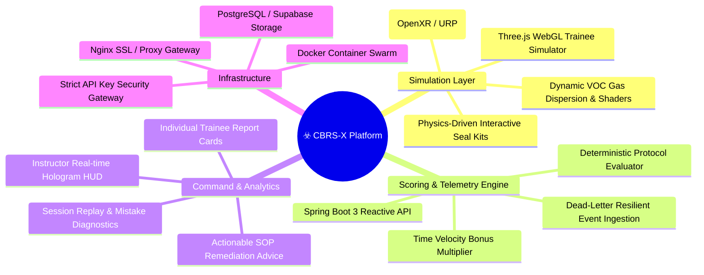
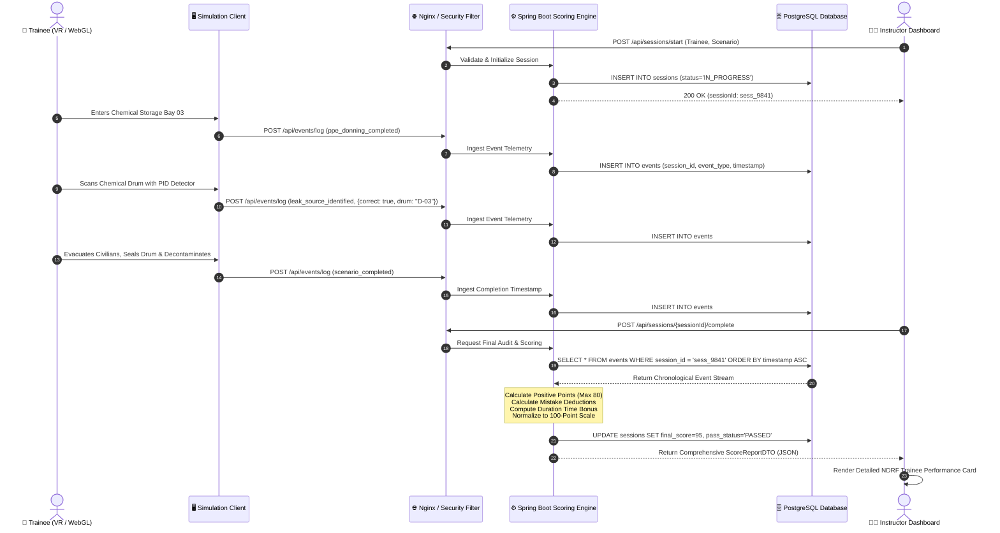
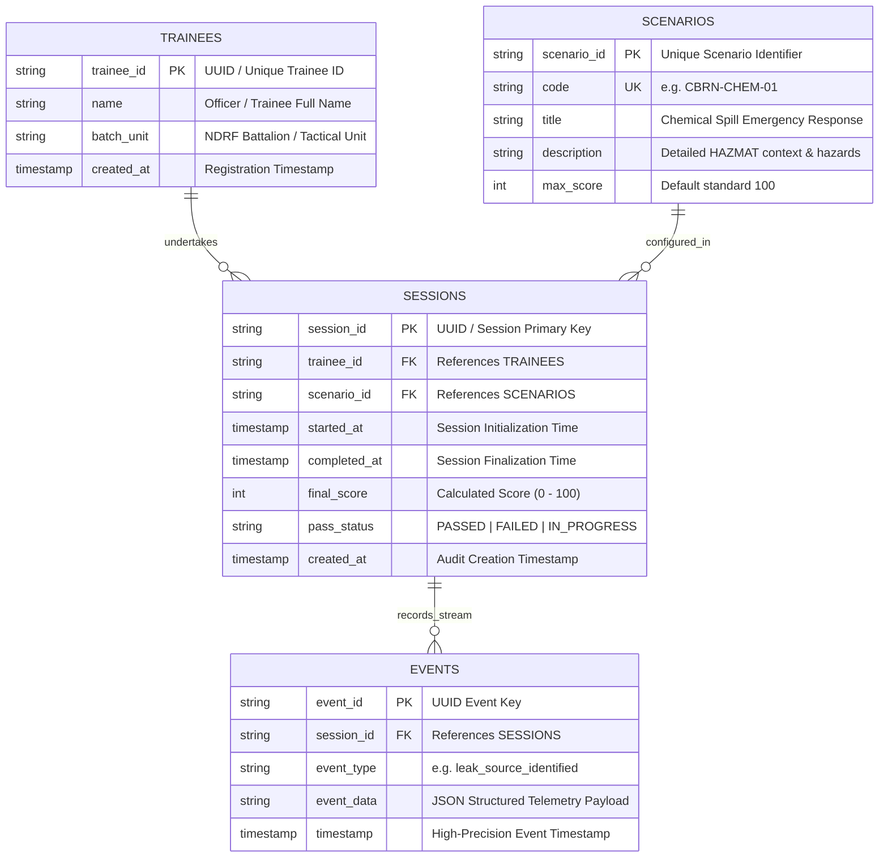

# ☣️ CBRS-X // CBRN HAZMAT PROTOCOL & RESPONSE SIMULATOR
### *Next-Gen Tactical VR & WebGL Chemical Incident Response Training Platform*

[](https://www.sih.gov.in)
[](https://www.ndrf.gov.in)
[-107C41.svg?style=for-the-badge&logo=gov.uk)]()
[](https://spring.io)
[](https://unity.com)
[](https://react.dev)
[](https://docker.com)

---

## 📑 TABLE OF CONTENTS
- [1. System Overview & Operational Lore](#-1-system-overview--operational-lore)
- [2. Tactical VR Heads-Up Display (HUD) Interface](#-2-tactical-vr-heads-up-display-hud-interface)
- [3. Technical Architecture & Data Pipeline](#-3-technical-architecture--data-pipeline)
  - [3.1 High-Level Topology & Flow](#31-high-level-topology--flow)
  - [3.2 Subsystem Specifications](#32-subsystem-specifications)
  - [3.3 Real-Time Telemetry & Scoring Sequence](#33-real-time-telemetry--scoring-sequence)
  - [3.4 Database Schema & Entity-Relationship Model](#34-database-schema--entity-relationship-model)
- [4. CBRN Incident Protocol Matrix & Scoring Engine](#-4-cbrn-incident-protocol-matrix--scoring-engine)
  - [4.1 Evaluation Criteria (100-Point Master Model)](#41-evaluation-criteria-100-point-master-model)
  - [4.2 Response Velocity & Time Bonus Matrix](#42-response-velocity--time-bonus-matrix)
  - [4.3 Safety Violations & Penalty Deductions](#43-safety-violations--penalty-deductions)
- [5. Repository Architecture & File Hierarchy](#-5-repository-architecture--file-hierarchy)
- [6. Standard Operating Procedures (Installation & Setup)](#-6-standard-operating-procedures-installation--setup)
  - [SOP-01: Full-Stack Docker Deployment (Recommended)](#sop-01-full-stack-docker-deployment-recommended)
  - [SOP-02: Spring Boot Scoring Engine (Backend Manual Setup)](#sop-02-spring-boot-scoring-engine-backend-manual-setup)
  - [SOP-03: Instructor Command Center (React Dashboard)](#sop-03-instructor-command-center-react-dashboard)
  - [SOP-04: Trainee 3D Web Simulation Station (Trainee View)](#sop-04-trainee-3d-web-simulation-station-trainee-view)
  - [SOP-05: Unity 3D / VR Headset Client Execution](#sop-05-unity-3d--vr-headset-client-execution)
- [7. Telemetry Ingestion API & Webhook Specifications](#-7-telemetry-ingestion-api--webhook-specifications)
- [8. Hardware & Operating Environment Specifications](#-8-hardware--operating-environment-specifications)
- [9. Incident Response Task Force (SIH260088)](#-9-incident-response-task-force-sih260088)
- [10. Compliance & Operational Guidelines](#-10-compliance--operational-guidelines)

---

## ☣️ 1. System Overview & Operational Lore

```
========================================================================================
[CLASSIFIED // NDRF TACTICAL RESPONSE DIVISION // HAZCHEM SECTOR 09]
INCIDENT SIMULATION DESIGNATION : CBRS-X / SCENARIO CBRN-CHEM-01
TARGET FACILITY                 : INDUSTRIAL STORAGE BAY 03 - HAZARDOUS CHEMICAL DEPOT
THREAT CLASSIFICATION           : LEVEL 4 VOLATILE ORGANIC / TOXIC INHALATION HAZARD (TIH)
PRIMARY MISSION                 : CONTAIN LEAK, SCAN DRUMS, EVACUATE CIVILIANS, DECONTAMINATE
========================================================================================
```

**CBRS-X** is an enterprise-grade Virtual Reality and WebGL chemical disaster simulation engine engineered specifically for **National Disaster Response Force (NDRF)** and hazardous industrial emergency teams. 

In high-stakes chemical, biological, radiological, and nuclear (CBRN) catastrophes, a single procedural mistake—stepping into a hot zone without positive-pressure SCBA, misreading photoionization detector (PID) ppm gradients, or bypassing three-stage decontamination—leads to irreversible human fatality and environmental contamination. 

**CBRS-X provides zero-risk, high-fidelity immersiveness** combined with deterministic telemetry scoring. Responders navigate physical spatial hazards in VR / WebGL 3D, while the backend continuously tracks their tactical decisions, timestamps, PID detector sampling accuracy, containment sealant kinetics, and decontamination compliance against standard NDRF Disaster Management Standard Operating Procedures.



---

## 🥽 2. Tactical VR Heads-Up Display (HUD) Interface

When deployed inside the simulation environment, responders are equipped with the **NDRF Tactical CBRN Responder HUD**:

```
 ╔══════════════════════════════════════════════════════════════════════════════════════════════════╗
 ║ [CBRS-X TACTICAL HUD] :: STORAGE BAY 03 INCIDENT               [ALERT LVL: HOT ZONE ACTIVE] ║
 ╠══════════════════════════════════════════════════════════════════════════════════════════════════╣
 ║  RESPIRATOR / PPE STATUS               PID GAS DETECTOR (VOC)         MISSION VELOCITY CLOCK   ║
 ║  ┌───────────────────────────────┐     ┌───────────────────────┐      ┌──────────────────────┐ ║
 ║  │ [✓] LEVEL-A ENCAPSULATED SUIT │     │ SENSOR : PID-VOC 10.6 │      │ MISSION TIME: 02:45  │ ║
 ║  │ [✓] POSITIVE PRESSURE SCBA    │     │ READING: 428.5 PPM ⚠️  │      │ TIER STATUS : GOLD   │ ║
 ║  │ [✓] BUTYL HAZMAT GLOVES       │     │ STATUS : LEL EXCEEDED │      │ MAX BONUS   : 20 PTS │ ║
 ║  └───────────────────────────────┘     └───────────────────────┘      └──────────────────────┘ ║
 ║                                                                                                  ║
 ║  ACTIVE TACTICAL OBJECTIVES                                   CIVILIAN CASUALTY STATUS           ║
 ║  [■] 1. DON COMPLETE CBRN SUIT & MASK BEFORE HOT ZONE GATE    TOTAL DETECTED IN BAY : [02]       ║
 ║  [■] 2. EQUIP PHOTOIONIZATION DETECTOR (PID) & LOCATE DRUM    EVACUATED TO SAFE ZONE: [02] (100%)║
 ║  [■] 3. EXTRACT ALL CIVILIANS TO STAGING AREA 01              TRAPPED / UNACCOUNTED : [00]       ║
 ║  [■] 4. APPLY EPOXY POLYMER COMPRESSION CLAMP ON DRUM #03                                        ║
 ║  [■] 5. UNDERGO 3-STAGE PRESSURIZED DECONTAMINATION SHOWER    SYSTEM TELEMETRY: 🟢 DISPATCH LIVE  ║
 ╚══════════════════════════════════════════════════════════════════════════════════════════════════╝
```

---

## 🏛️ 3. Technical Architecture & Data Pipeline

### 3.1 High-Level Topology & Flow

```mermaid
flowchart TD
    subgraph Simulation_Clients ["🕹️ Frontline Simulation Clients"]
        VR["Unity 3D VR Client<br/>(OpenXR / Meta Quest / SteamVR)"]
        Web3D["React Trainee View<br/>(Three.js 3D WebGL Simulator)"]
    end

    subgraph Gateway ["🌐 Ingress & Routing Gateway"]
        Nginx["Nginx Reverse Proxy & Load Balancer<br/>(Port 80 / 5000 / SSL Termination)"]
    end

    subgraph Backend_Engine ["⚙️ Core Telemetry & Scoring Services"]
        SpringCore["Spring Boot 3.2 Backend Engine<br/>(Java 17 / Spring Security)"]
        AuthFilter["Dual Auth Gateway<br/>(Session Cookie + CSRF / X-API-Key Validator)"]
        ScoringService["Deterministic Protocol Scoring Engine<br/>(ScoringService.java)"]
        SessionService["Session Orchestrator & State Machine"]
    end

    subgraph Persistence ["🗄️ Persistence Layer"]
        DB[("PostgreSQL / Supabase<br/>(Sessions, Events, Trainees, Scenarios)")]
        H2[("H2 Embedded DB<br/>(Dev / Fallback Mode)")]
    end

    subgraph Command_Center ["📊 Instructor Operations"]
        InstructorUI["React 18 Instructor Dashboard<br/>(Real-Time Analytics & Replay)"]
        ThreeHolo["Three.js Holographic Bay-03 Scene"]
    end

    VR -->|POST /api/events/log JSON| Nginx
    Web3D -->|POST /api/events/log JSON| Nginx
    Nginx --> AuthFilter
    AuthFilter --> SpringCore
    SpringCore --> SessionService
    SessionService --> ScoringService
    SessionService --> DB
    SessionService -.-> H2
    InstructorUI -->|GET /api/dashboard/stats| Nginx
    InstructorUI -->|POST /api/sessions/start| Nginx
    InstructorUI -->|POST /api/sessions/{id}/complete| Nginx
    ThreeHolo --- InstructorUI
```

---

### 3.2 Subsystem Specifications

| Subsystem | Primary Technologies | Port / Endpoint | Operational Description |
|---|---|---|---|
| **VR Tactical Simulation** | Unity 2022.3 LTS, C#, URP, OpenXR, XR Interaction Toolkit | Native Headset App | Physics-based first-person hazard environment with dynamic particle clouds, PID gas raycasting, interactive Hazmat equipment, and offline dead-letter queue. |
| **Trainee WebGL Station** | React 18, Three.js, Lucide Icons, Vite | `http://localhost:5000` | Browser-accessible 3D tactical simulation allowing desktop trainees to inspect Bay-03, equip PPE, operate PID meters, patch drums, and trigger event payloads without VR hardware. |
| **Telemetry & Scoring Engine** | Java 17, Spring Boot 3.2, Spring Data JPA, HikariCP | `http://localhost:8080` | High-throughput REST engine consuming telemetry events, enforcing security policies, executing deterministic penalty models, and compiling report cards. |
| **Instructor Command Center** | React 18, Vite, Three.js, Recharts, Vanilla CSS Design System | `http://localhost:3000` | Real-time tactical command desk featuring live pass/fail statistics, animated 3D hazard facility digital twin, event simulator, and granular mistake remediation cards. |
| **Database & Persistence** | PostgreSQL 15 (Supabase) / H2 In-Memory | Port `5432` / JDBC | Normalized relational storage managing trainee profiles, training scenarios, time-indexed event telemetry streams, and final evaluation audit logs. |
| **Gateway & Proxy** | Nginx 1.25 Alpine | Port `80` (Proxy), `5000` | High-performance reverse proxy routing `/api/**` to backend and serving optimized static bundles with CORS negotiation. |

---

### 3.3 Real-Time Telemetry & Scoring Sequence



---

### 3.4 Database Schema & Entity-Relationship Model



---

## 🎯 4. CBRN Incident Protocol Matrix & Scoring Engine

The scoring engine implements strict NDRF Disaster Protocol logic. Trainees start with a baseline evaluation against 5 operational core competencies + velocity bonus, offset by critical safety penalty deductions.

### 4.1 Evaluation Criteria (100-Point Master Model)

$$\text{Raw Positive Score} = \text{PPE} + \text{Detection} + \text{Evacuation} + \text{Containment} + \text{Decontamination} + \text{Time Bonus}$$

$$\text{Net Score} = \max(0, \text{Raw Positive Score} - \text{Total Penalties})$$

$$\text{Final Score (100\% Normalized)} = \min\left(100, \text{round}\left(\frac{\text{Net Score}}{80} \times 100\right)\right)$$

| Protocol Stage | Max Points | Qualifying Criteria | Sub-Criteria & Partial Scoring |
|---|---|---|---|
| **1. PPE Donning & Verification** | **10 pts** | Full Level-A CBRN Suit, Boots, Gloves & Mask donned prior to crossing hot zone threshold. | • 10 pts: Complete PPE donned before entry.<br/>• 5 pts: Incomplete suit or donning in hazardous atmosphere. |
| **2. Detection & Identification** | **10 pts** | Proper deployment of PID Gas Detector and correct identification of toxic chemical drum. | • 10 pts: Correct drum identified with 0 false positive scans.<br/>• 5 pts: Correct drum identified but with incorrect scans. |
| **3. Civilian Search & Rescue** | **15 pts** | Safe extraction of all civilian personnel trapped inside Storage Bay 03. | • 15 pts: Both civilians evacuated safely to staging area.<br/>• 5 pts per civilian evacuated during partial rescue. |
| **4. Hazard Seal & Containment** | **15 pts** | Deployment of chemical containment kit / epoxy clamp on leaking drum valve. | • 15 pts: Containment completed successfully.<br/>• 0 pts: Containment skipped or failed. |
| **5. Decontamination Station** | **10 pts** | Complete passage through 3-stage chemical shower and runoff drainage zone. | • 10 pts: Decontamination protocol executed.<br/>• 0 pts: Decon station bypassed. |
| **6. Operational Velocity Bonus** | **20 pts** | Speed of hazard neutralization based on benchmark times. | Dependent on duration tiers (see Table 4.2). |

---

### 4.2 Response Velocity & Time Bonus Matrix

```
       00:00                     03:00                     05:00                     07:30
         ├─────────────────────────┼─────────────────────────┼─────────────────────────┤
         │   TIER 1 : EXCELLENT    │      TIER 2 : GOOD      │   TIER 3 : ACCEPTABLE   │  TIER 4 : SLOW
         │        +20 PTS          │         +15 PTS         │         +10 PTS         │     +5 PTS
         └─────────────────────────┴─────────────────────────┴─────────────────────────┘
```

| Response Velocity Tier | Elapsed Mission Time | Bonus Awarded | Tactical Assessment |
|---|---|---|---|
| 🥇 **Tier 1: Excellent** | $\le 180 \text{ seconds } (\le 3.0 \text{ min})$ | **+20 Points** | Rapid tactical containment; zero ambient toxic dispersion. |
| 🥈 **Tier 2: Good** | $181 - 300 \text{ seconds } (3.0 - 5.0 \text{ min})$ | **+15 Points** | Standard response efficiency; minimal vapor drift. |
| 🥉 **Tier 3: Acceptable** | $301 - 450 \text{ seconds } (5.0 - 7.5 \text{ min})$ | **+10 Points** | Acceptable containment; prolonged chemical exposure risk. |
| ⚠️ **Tier 4: Sub-Optimal** | $> 450 \text{ seconds } (> 7.5 \text{ min})$ | **+5 Points** | Mission completed but critical exposure threshold reached. |

---

### 4.3 Safety Violations & Penalty Deductions

> [!CAUTION]
> Safety penalties are directly subtracted from the raw score before final normalization. A single critical safety violation can result in an immediate mission failure ($\text{Final Score} < 70\%$).

| Violation Code | Infraction Description | Penalty Points | Severity Level | Tactical Impact & Real-World Consequence |
|---|---|:---:|:---:|---|
| `PEN-PPE-01` | **Entered Hazard Zone Without Complete PPE** | **-15 pts** | **CRITICAL** | Lethal respiratory and transdermal toxin absorption. |
| `PEN-DET-02` | **False Positive Drum Identification** | **-5 pts** | **MEDIUM** | Misapplication of neutralizer; wasted containment supplies. |
| `PEN-EVAC-03` | **Civilian Left Behind in Danger Zone** | **-10 pts / civ** | **HIGH** | Civilian casualty due to prolonged inhalation of toxic fumes. |
| `PEN-CONT-04` | **Containment Protocol Skipped / Incomplete** | **-15 pts** | **CRITICAL** | Continuous atmospheric poisoning and environmental spill. |
| `PEN-DECON-05`| **Decontamination Shower Protocol Bypassed** | **-10 pts** | **HIGH** | Secondary contamination of clean staging area and team. |

---

## 📂 5. Repository Architecture & File Hierarchy

```
CBRN-X/
├── .github/
│   └── workflows/
│       └── ci.yml                     # Multi-stage CI pipeline (Maven, React build, Docker test)
├── .env.example                       # Reference environment configuration template
├── .gitignore                         # Industrial-grade exclusion rules (builds, logs, temp)
├── docker-compose.yml                 # Multi-container orchestration (DB, backend, UI, proxy)
├── nginx.conf                         # Reverse proxy gateway & port routing configuration
├── README.md                          # Master technical blueprint & tactical handbook
│
├── backend/                           # ☕ SPRING BOOT 3.2 SCORING & TELEMETRY ENGINE
│   ├── Dockerfile                     # Multi-stage Eclipse Temurin JDK 17 container build
│   ├── pom.xml                        # Maven dependencies (JPA, Security, Actuator, PostgreSQL)
│   └── src/
│       ├── main/
│       │   ├── java/com/cbrsx/backend/
│       │   │   ├── CbrsBackendApplication.java   # Spring Boot Application entrypoint
│       │   │   ├── WebCorsConfig.java            # Dynamic CORS origin mapping
│       │   │   ├── controller/                   # REST API Controllers (Sessions, Events, Stats)
│       │   │   ├── dto/                          # Immutable Data Transfer Objects & Payloads
│       │   │   ├── entity/                       # JPA Entities (Trainee, Scenario, Session, Event)
│       │   │   ├── repository/                   # Spring Data JPA interfaces with indexed queries
│       │   │   ├── security/                     # API Key authentication filter & SecurityFilterChain
│       │   │   └── service/                      # ScoringService (penalty/bonus) & SessionService
│       │   └── resources/
│       │       ├── application.yml               # Unified Spring configuration
│       │       ├── application-dev.yml           # H2 in-memory local testing profile
│       │       ├── application-prod.yml          # PostgreSQL production profile
│       │       └── schema.sql                    # DDL table definitions & seed data
│       └── test/                                 # Unit & Integration tests (Scoring engine JUnit 5)
│
├── dashboard/                         # 📊 INSTRUCTOR COMMAND CENTER (REACT 18)
│   ├── Dockerfile                     # Node 20 build + Nginx Alpine static serving container
│   ├── index.html                     # Root HTML document
│   ├── package.json                   # Dependencies (Three.js, React Three Fiber, Lucide, Recharts)
│   ├── vite.config.js                 # Vite bundler configuration with backend proxy routing
│   └── src/
│       ├── App.jsx                    # Root instructor dashboard view
│       ├── components/
│       │   ├── Header.jsx             # Tactical status bar & live connection state
│       │   ├── MetricCards.jsx        # Summary KPI cards (Pass rate, Average score, Trainees)
│       │   ├── Hero3DScene.jsx        # Three.js 3D Holographic digital twin of Bay 03
│       │   ├── EventSimulator.jsx     # Interactive telemetry dispatcher & test harness
│       │   ├── SessionsTable.jsx      # Sortable historical session audit table
│       │   └── SessionDetailModal.jsx # Granular trainee scorecard & NDRF SOP advice
│       └── index.css                  # Dark-mode industrial CSS design system
│
├── trainee_view/                      # 🥽 TRAINEE 3D SIMULATION STATION (WEBGL / THREE.JS)
│   ├── Dockerfile                     # Trainee frontend container definition
│   ├── package.json                   # Trainee UI dependencies
│   ├── vite.config.js                 # Dev server on port 5000 with API proxy
│   └── src/
│       ├── App.jsx                    # 3D interactive first-person responder viewport
│       ├── Hotspots.jsx               # Interactive equipment stations (PPE, PID, Drums, Decon)
│       ├── CursorParallax.jsx         # Head-tracking visual depth and camera dynamics
│       ├── PostProcessing.jsx         # Chemical haze, vignette, and emergency alarm strobes
│       └── index.css                  # HUD overlays, meters, and status widgets
│
├── unity_scripts/                     # 🕹️ UNITY 3D C# ENGINE SCRIPTS (TACTICAL VR CLIENT)
│   ├── CbrsEventLogger.cs             # Resilient asynchronous telemetry dispatcher with journal
│   ├── FirstPersonResponderController.cs # First-person movement & XR Interaction rig controller
│   ├── GasDetector.cs                 # Photoionization detector (PID) ppm sensor logic
│   ├── LeakDrum.cs                    # Chemical hazard emitter & leak point simulation
│   ├── ContainmentKit.cs              # Polymer compression seal interaction logic
│   ├── DeconStation.cs                # 3-stage decontamination shower trigger & timer
│   ├── PpeStation.cs                  # Level-A hazmat suit donning station
│   ├── Civilian.cs                    # NPC search & rescue evacuation AI
│   ├── GameManager.cs                 # Scenario state coordinator & objective manager
│   ├── HudManager.cs                  # VR canvas heads-up display renderer
│   └── MultiCameraController.cs       # Tactical isometric, CCTV & first-person camera switcher
│
└── docs/                              # 📚 OPERATIONAL MANUALS & ASSET INTEGRATION GUIDES
    └── UNITY_ASSET_INTEGRATION_WORKFLOW.md # Pipeline guide for 3D FBX assets, textures & URP shaders
```

---

## 🛠️ 6. Standard Operating Procedures (Installation & Setup)

### SOP-01: Full-Stack Docker Deployment (Recommended)

To stand up the entire CBRS-X ecosystem (PostgreSQL database, Spring Boot engine, Instructor Dashboard, Trainee Web View, and Nginx Gateway) in a single command:

```powershell
# 1. Clone the incident repository
git clone https://github.com/Lohith-RC/CBRN-X.git
cd CBRN-X

# 2. Configure operational environment
Copy-Item .env.example .env

# 3. Launch container swarm
docker compose up --build -d

# 4. Verify system health
docker compose ps
```

**Operational Access Matrix:**
- 🖥️ **Instructor Command Center:** `http://localhost:80` (or `http://localhost:3000`)
- 🥽 **Trainee WebGL Simulator:** `http://localhost:5000`
- ⚙️ **Spring Boot API Engine:** `http://localhost:8080/actuator/health`
- 🗄️ **PostgreSQL Database:** `localhost:5432` (`cbrsx_db`)

---

### SOP-02: Spring Boot Scoring Engine (Backend Manual Setup)

**Prerequisites:** JDK 17+ and Apache Maven 3.8+ installed.

```powershell
# Navigate to backend module
cd backend

# Execute test suite (verifies scoring algorithms & penalty models)
mvn clean test

# Run with local H2 in-memory development profile
mvn spring-boot:run -Dspring-boot.run.profiles=dev

# (Optional) Run with production PostgreSQL profile
mvn spring-boot:run -Dspring-boot.run.profiles=prod
```

> [!NOTE]
> Backend REST services will bind to `http://localhost:8080`. By default in `dev` profile, schema tables and demo data are auto-seeded via `schema.sql`.

---

### SOP-03: Instructor Command Center (React Dashboard)

**Prerequisites:** Node.js 18+ and npm 9+ installed.

```powershell
# Navigate to dashboard module
cd dashboard

# Install UI dependencies
npm install

# Start development workstation on port 3000
npm run dev
```

Open `http://localhost:3000` in Google Chrome or Microsoft Edge.

---

### SOP-04: Trainee 3D Web Simulation Station (Trainee View)

**Prerequisites:** Node.js 18+ and npm 9+ installed.

```powershell
# Navigate to trainee view module
cd trainee_view

# Install dependencies
npm install

# Launch WebGL 3D simulator on port 5000
npm run dev
```

Open `http://localhost:5000` to interact with the 3D chemical bay simulation and test live telemetry transmission.

---

### SOP-05: Unity 3D / VR Headset Client Execution

**Prerequisites:** Unity 2022.3.x LTS (with Universal Render Pipeline and OpenXR packages installed).

1. Launch **Unity Hub** and select **Open Project**.
2. Point the path to the root folder of this repository (`CBRN-X`).
3. In Unity Project Settings, verify that **XR Plug-in Management** is enabled for **OpenXR** (Meta Quest / SteamVR / Windows XR).
4. Open scene: `Assets/Scenes/StorageBay03_TacticalSimulation.unity`.
5. In the Hierarchy, locate the `[GameManager]` and `[CbrsEventLogger]` GameObjects.
6. In the Inspector, configure the `backendBaseUrl`:
   ```
   http://localhost:8080/api
   ```
7. Press **Play** in the Unity Editor or build a standalone executable via `File -> Build and Run`.

---

## 📡 7. Telemetry Ingestion API & Webhook Specifications

### 7.1 Start New Training Session
`POST /api/sessions/start`

**Request Payload:**
```json
{
  "traineeName": "Lohith R C",
  "batchUnit": "10th Bn NDRF (Andhra Pradesh)",
  "scenarioCode": "CBRN-CHEM-01"
}
```

**Response Payload (200 OK):**
```json
{
  "sessionId": "sess_f4a7c891e23",
  "traineeId": "trn_8829a10bc4",
  "scenarioId": "scen-chem-01"
}
```

---

### 7.2 Transmit Tactical Event Telemetry
`POST /api/events/log`

```json
{
  "sessionId": "sess_f4a7c891e23",
  "eventType": "leak_source_identified",
  "eventData": "{\"correct\": true, \"drum_id\": \"DRUM-03\", \"voc_ppm\": 428.5}",
  "timestamp": "2026-08-24T12:00:15.820Z"
}
```

**Supported Standard Event Types:**
- `ppe_donning_completed` — Level-A suit equipped before entry.
- `entered_hazard_zone_without_ppe` — Critical breach event.
- `detector_equipped` — PID sensor powered on.
- `leak_source_identified` — Chemical container scan (`{"correct": true|false}`).
- `civilian_evacuated` — Single civilian transported to green zone.
- `evacuation_incomplete` — Left behind report (`{"count": 1}`).
- `containment_completed` — Epoxy seal clamp applied.
- `decontamination_completed` — Multi-stage shower completed.
- `scenario_completed` — Mission exit point reached.

---

### 7.3 Finalize & Audit Session Score
`POST /api/sessions/{sessionId}/complete`

**Response Report Structure (Sample):**
```json
{
  "sessionId": "sess_f4a7c891e23",
  "traineeName": "Lohith R C",
  "batchUnit": "10th Bn NDRF (Andhra Pradesh)",
  "scenarioCode": "CBRN-CHEM-01",
  "scenarioTitle": "Chemical Spill Emergency Response",
  "totalDurationSeconds": 142,
  "finalScore": 100,
  "passStatus": "PASSED",
  "passed": true,
  "breakdown": {
    "ppeScore": 10,
    "detectionScore": 10,
    "evacuationScore": 15,
    "containmentScore": 15,
    "decontaminationScore": 10,
    "timeBonusScore": 20,
    "totalPenalties": 0,
    "netScore": 80
  },
  "mistakes": [],
  "recommendations": [
    "Excellent response! Full compliance with NDRF Chemical Disaster Standard Operating Procedure."
  ]
}
```

---

## 💻 8. Hardware & Operating Environment Specifications

```
  ╔═════════════════════════════════════════════════════════════════════════════════════════════════╗
  ║                        HARDWARE COMPATIBILITY & SYSTEM REQUIREMENTS                             ║
  ╠═════════════════════════════════════════════════════════════════════════════════════════════════╣
  ║  COMPONENT            MINIMUM SPECIFICATION             TACTICAL RECOMMENDED SPEC               ║
  ║  ─────────────────────────────────────────────────────────────────────────────────────────────  ║
  ║  VR Headset           Meta Quest 2 (via Link / AirLink) Meta Quest 3 / Quest Pro / HTC Vive Pro ║
  ║  Processor (CPU)      Intel Core i5-10400 / Ryzen 5 3600 Intel Core i7-13700K / Ryzen 7 7800X3D ║
  ║  Graphics (GPU)       NVIDIA GeForce GTX 1660 Ti (6GB)  NVIDIA GeForce RTX 4070 / RTX 3080      ║
  ║  System RAM           16 GB DDR4 Dual-Channel           32 GB DDR5 6000MHz                      ║
  ║  Storage              10 GB SSD (NVMe Preferred)        25 GB PCIe 4.0 NVMe SSD                 ║
  ║  Operating System     Windows 10 / 11 64-bit            Windows 11 Pro 64-bit                   ║
  ║  Display / WebGL      1920 x 1080 @ 60Hz                2560 x 1440 @ 144Hz (Color Accurate)    ║
  ╚═════════════════════════════════════════════════════════════════════════════════════════════════╝
```

---

## 👥 9. Incident Response Task Force (SIH260088)

| Team Member | Engineering Role | Core Responsibilities |
|---|---|---|
| 🎖️ **Lohith R C** | **Team Lead & System Architect** | Supabase/PostgreSQL schema, Spring Boot 3 REST Core, Telemetry pipeline & Docker orchestration. |
| 🛡️ **Monica K S** | **Backend & Protocol Verification** | Spring Data JPA models, validation layers, exception handling & deterministic protocol scoring tests. |
| 🥽 **Chandana M N** | **Unity VR / Physics Developer** | XR Interaction Toolkit integration, PID raycasting, player mechanics & asynchronous telemetry logger. |
| 🏭 **Harshini R B** | **Environment & 3D Tech Artist** | Storage Bay 03 modular environment design, URP lighting, PBR materials & hazard particle systems. |
| 📊 **Chandana M P** | **Frontend Command Engineer** | Instructor Dashboard UI architecture, Three.js 3D hologram scene, real-time KPI metrics & report card UI. |
| 📋 **Pavitra J H** | **QA, Documentation & UI/UX** | NDRF SOP compliance verification, Trainee WebGL view design, user experience testing & technical documentation. |

---

## 📜 10. Compliance & Operational Guidelines

- **NDRF Tactical Alignment:** Scenario workflows conform to Indian National Disaster Response Force SOPs for Hazardous Materials (HAZMAT) and Chemical, Biological, Radiological, and Nuclear (CBRN) incident management.
- **Safety Exemption:** This simulation software is designed strictly for training and protocol simulation. It does not replace physical hands-on live Hazmat drill certifications.
- **Security & Key Management:** CBRS-X uses dual authentication paths. Browser clients (instructor dashboard, trainee views) authenticate interactively with username/password; the session cookie plus CSRF token authorize all subsequent requests, including the `/ws-telemetry` WebSocket handshake (no API key is ever shipped in browser JavaScript). Machine clients (Unity VR engine, simulators) must present `X-API-Key` HTTP/STOMP headers provisioned from `CBRSX_API_KEY` (or role-scoped `CBRSX_INSTRUCTOR_KEY` / `CBRSX_SIMULATION_KEY` / `CBRSX_TRAINEE_KEY`) environment variables. Production deployments (`SPRING_PROFILES_ACTIVE=prod`) fail closed: the backend refuses to start unless at least one API key is configured, and STOMP CONNECT frames without a valid session or key are rejected. CSV exports stream server-side from `GET /api/sessions/export` (instructor/admin only) and report truncation via the `X-CBRSX-Truncated` header when the 50,000-row cap is hit.

```
========================================================================================
[END TRANSMISSION // CBRS-X INCIDENT COMMAND PROTOCOL ACTIVE // NDRF SECTOR 09]
========================================================================================
```
....................................................