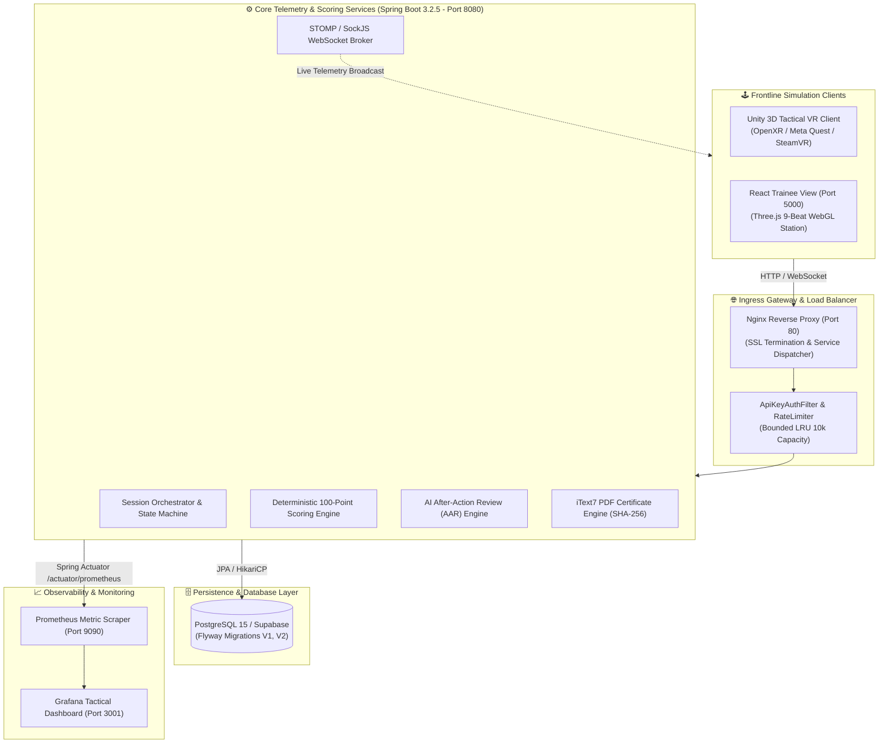

# ☣️ CBRS-X // CBRN HAZMAT PROTOCOL & RESPONSE SIMULATOR
### *Enterprise Tactical VR & WebGL Chemical, Biological & Radiological Emergency Training Platform*

<div align="center">

[](https://www.sih.gov.in)
[](https://www.ndrf.gov.in)
[-138808.svg?style=for-the-badge&logo=gov.uk&logoColor=white)](https://mha.gov.in)
[](https://kit-tpt.ac.in)

[](https://spring.io)
[](https://unity.com)
[](https://react.dev)
[](https://postgresql.org)
[](https://docker.com)
[]()

</div>

---

```
========================================================================================================================
[CLASSIFIED // NDRF TACTICAL RESPONSE DIVISION // HAZCHEM & CBRN SECTOR 09]
INCIDENT SIMULATION DESIGNATION : CBRS-X / SCENARIOS: CBRN-CHEM-01 / CBRN-RAD-02 / CBRN-BIO-03
TARGET OPERATIONAL FACILITY     : INDUSTRIAL STORAGE BAY 03 - HAZARDOUS MATERIAL & ISOTOPE DEPOT
THREAT CLASSIFICATION           : LEVEL 4 VOLATILE ORGANIC / RADIOLOGICAL DISPERSION / AIRBORNE BIO-HAZARD
PRIMARY MISSION CYCLE           : DETECT ➔ PROTECT (PPE) ➔ CONTAIN ➔ EVACUATE ➔ DECONTAMINATE
TELEMETRY & SCORING STATUS      : SPRING BOOT 3.2.5 DETERMINISTIC AUDIT ENGINE [ACTIVE // PORT 8080]
========================================================================================================================
```

---

## 📑 Master Table of Contents

- [1. 🛡️ Executive Summary & Problem Statement Lore](#1-️-executive-summary--problem-statement-lore)
- [2. 🚀 Quickstart Guide (New User Perspective)](#2--quickstart-guide-new-user-perspective)
- [3. 🏛️ Master System Architecture & Multi-Tier Topology](#3-️-master-system-architecture--multi-tier-topology)
- [4. 🥽 Frontline Simulation Clients (VR & WebGL 3D)](#4--frontline-simulation-clients-vr--webgl-3d)
- [5. 🎯 Multi-Hazard Protocol Matrix & Scoring Model](#5--multi-hazard-protocol-matrix--scoring-model)
- [6. 📊 Instructor Tactical Command Center & Analytics](#6--instructor-tactical-command-center--analytics)
- [7. 🔒 Enterprise Security & Threat Model Hardening (Admin Perspective)](#7--enterprise-security--threat-model-hardening-admin-perspective)
- [8. 📡 REST API & STOMP WebSocket Specifications](#8--rest-api--stomp-websocket-specifications)
- [9. 🗄️ Database Architecture & Flyway Migrations](#9-️-database-architecture--flyway-migrations)
- [10. 📈 Observability & Monitoring (Prometheus & Grafana)](#10--observability--monitoring-prometheus--grafana)
- [11. 🛠️ Standard Operating Procedures (Installation & Setup)](#11-️-standard-operating-procedures-installation--setup)
- [12. 🔄 Disaster Recovery, Backups & E2E Validation](#12--disaster-recovery-backups--e2e-validation)
- [13. 👥 Engineering Task Force (SIH260088)](#13--engineering-task-force-sih260088)
- [14. 📜 Compliance & Verification Status](#14--compliance--verification-status)

---

## 1. 🛡️ Executive Summary & Problem Statement Lore

**CBRS-X** is an enterprise-grade Virtual Reality and WebGL disaster response simulation ecosystem engineered specifically for the **National Disaster Response Force (NDRF)**, hazardous materials (HAZMAT) emergency squads, petrochemical disaster response units, and civil defense agencies under **Smart India Hackathon (SIH) Problem Statement SIH260088**.

In real-world CBRN incidents, procedural infractions—such as entering a volatile hot zone without positive-pressure SCBA, misinterpreting photoionization detector (PID) ppm gradients, failing to isolate ventilation airlocks, or bypassing multi-stage decontamination—lead to catastrophic toxic exposure and loss of human life.

**CBRS-X delivers zero-risk, high-fidelity immersive tactical training** coupled with an automated deterministic telemetry scoring engine. First responders navigate hazardous industrial environments in VR or WebGL 3D while the backend continuously audits decisions, timestamps, PID detector sampling accuracy, containment sealant kinetics, and decontamination compliance against standard NDRF Standard Operating Procedures (SOPs).

```mermaid
mindmap
  root((☣️ CBRS-X Platform))
    Simulation Layer
      Unity 2022.3 LTS VR Client (OpenXR / URP)
      Three.js WebGL Trainee Simulator (9-Beat Engine)
      Volumetric Gaussian Plume Dispersion Shaders
      Physics-Driven Interactive Seal Kits & Decon Archway
    Scoring & Telemetry Engine
      Spring Boot 3.2.5 Reactive Telemetry Ingestion
      Deterministic 100-Point Protocol Evaluator
      Multi-Hazard Polymorphic Logic (Chem, Rad, Bio)
      Dead-Letter Resilient Event Ingestion Queue
    Command & Analytics
      Instructor Real-time Hologram HUD & Tactical Grid
      Longitudinal Trainee Skill-Growth Learning Curve
      Automated AI After-Action Review (AAR) Debrief
      Official PDF Certificate Engine with SHA-256 Digest
    Security & Infrastructure
      PostgreSQL 15 / Supabase Persistent Storage
      STOMP WebSocket Header Authentication
      Sliding-Window LRU Rate Limiting (10k IP Bounded)
      DDE / CSV Formula Injection Sanitization Guard
```

---

## 2. 🚀 Quickstart Guide (New User Perspective)

### 2.1 Prerequisites
- **Node.js**: v18.0.0+ (`node -v`)
- **Java**: JDK 17+ (`java -version` - *optional if using Docker*)
- **Docker & Docker Compose**: (*recommended for full-stack one-click launch*)

### 2.2 Option A: One-Click Launch via PowerShell (Windows)
```powershell
# 1. Clone the repository
git clone https://github.com/Lohith-RC/CBRN-X.git
cd CBRN-X

# 2. Launch all services simultaneously with auto-JDK detection and Maven fallback
.\start_all_services.ps1
```

### 2.3 Option B: One-Click Production Deployment via Docker Compose
```bash
# 1. Copy master environment configuration
cp .env.example .env

# 2. Build and launch all 6 service containers in background
docker compose up --build -d
```

### 2.4 Service Port Mapping & Access Points

| Service | Port / URL | Description | Default Credentials |
| :--- | :--- | :--- | :--- |
| **Instructor Dashboard** | [http://localhost:3000](http://localhost:3000) | Tactical Command Center, Analytics, DVR Replay | `admin` / `ndrf-admin-123` |
| **Trainee Web Station** | [http://localhost:5000](http://localhost:5000) | 9-Beat Interactive 3D WebGL Simulation Station | N/A (One-Click Launch) |
| **Unity 3D WebGL Sim** | [http://localhost:3000/unity-sim/index.html](http://localhost:3000/unity-sim/index.html) | Direct Embedded 3D Viewport | N/A |
| **Spring Boot Backend** | [http://localhost:8080](http://localhost:8080) | REST API, STOMP WebSockets, Scoring Engine | Header `X-API-Key: dev_api_key_cbrsx_demo_9841` |
| **Prometheus Metrics** | [http://localhost:9090](http://localhost:9090) | Telemetry Ingestion Rate, P99 Latencies | N/A |
| **Grafana Dashboards** | [http://localhost:3001](http://localhost:3001) | Live Tactical Grid & Health Observability | `admin` / `cbrsx-grafana-2026` |

---

## 3. 🏛️ Master System Architecture & Multi-Tier Topology



---

## 4. 🥽 Frontline Simulation Clients (VR & WebGL 3D)

### 4.1 Trainee 3D Web Station (9-Beat Narrative Engine)
The web-based trainee station (`trainee_view` on port 5000) delivers an interactive 9-beat disaster response progression mapped directly to NDRF SOPs:

```
[0:00] BEAT 1: CCTV Surveillance & Catastrophic Toxic Breach Notice
[0:07] BEAT 2: First-Person Safety Orientation & Airlock Approach
[0:14] BEAT 3: Environmental Sensor Raycast & IDLH Hazard Scan
[0:21] BEAT 4: Level-A/B Chemical PPE Donning Station Lock-On
[0:28] BEAT 5: Torso Suit Hermetic Zipping & Positive Pressure Check
[0:35] BEAT 6: CBRN Full-Face Respirator Seal & Visor Activation
[0:42] BEAT 7: Chemical-Resistant Glove Snapping & Barrier Clearance
[0:49] BEAT 8: Tactical Advance into Storage Bay 03 Perimeter
[0:56] BEAT 9: Photoionization Detector (PID) Deployment & Drum Cluster Scan
```

### 4.2 Unity 2022.3 Tactical VR Client (OpenXR / URP)
- **Engine**: Unity 2022.3 LTS using Universal Render Pipeline (URP).
- **Physics**: Real-time rigid-body collision for gas cylinder patch kits and inflatable pipe pluggers.
- **Visuals**: Volumetric smoke shaders modeling Gaussian plume dispersion and real-time gas density raycasting.

---

## 5. 🎯 Multi-Hazard Protocol Matrix & Scoring Model

### 5.1 Normalized 100-Point Scoring Formula

$$\text{Final Score} = S_{\text{PPE}} + S_{\text{Detection}} + S_{\text{Containment}} + S_{\text{Evacuation}} + S_{\text{Decon}} + S_{\text{Velocity}} - \sum P_{\text{SafetyViolations}}$$

| Evaluation Category | Max Points | Evaluation Criteria |
| :--- | :---: | :--- |
| **PPE Donning Sequence** | **20 pts** | Proper chronological order: Suit $\rightarrow$ Mask $\rightarrow$ Gloves before hot-zone entry |
| **Hazard Identification** | **20 pts** | Accurate PID sensor / Geiger counter / Bio-sampler source localization |
| **Leak Containment** | **20 pts** | Rapid application of magnetic patch / chemical foam sealant / lead shielding |
| **Civilian Evacuation** | **20 pts** | Triaging and escorting trapped industrial personnel through cold-zone corridor |
| **Decontamination SOP** | **10 pts** | Multi-stage washdown compliance and residue verification |
| **Velocity Bonus** | **10 pts** | Execution speed bonus for completion within baseline operational time |
| **Critical Safety Penalties** | **Up to -50 pts** | Immediate deduction for entering hot zone without PPE or incorrect equipment |

---

## 6. 📊 Instructor Tactical Command Center & Analytics

The Command Dashboard (`dashboard` on port 3000) provides real-time oversight for NDRF battalion instructors:
- **Judges Evaluation Console**: Comprehensive multi-tab overview with animated SVG score rings and radar charts.
- **Mission DVR Replay**: Time-travel scrub bar allowing full replay of trainee spatial trajectory and event logs.
- **Dynamic Certificate Generator**: Automated PDF generation sealed with SHA-256 cryptographic digest and QR verification.
- **AI Debrief (After-Action Review)**: Automated tactical critique highlighting response strengths and procedural remediation.

---

## 7. 🔒 Enterprise Security & Threat Model Hardening (Admin Perspective)

| Security Vector | Mitigation Strategy & Implementation |
| :--- | :--- |
| **Authentication & RBAC** | BCrypt (cost 12) for instructor accounts; role-scoped API keys (`X-API-Key`) for machines |
| **CSRF Defense** | Double-submit `CBRSX-XSRF` cookie with `SameSite=Lax` and explicit API-key exemption |
| **Rate Limiting & Anti-DDoS** | Bounded LRU sliding-window filter (10,000 IP capacity; 120 req/min threshold) |
| **Injection Defense** | Parameterized JPA repositories; CSV/DDE formula sanitization against spreadsheet injection |
| **Fail-Closed Architecture** | Production profile (`application-prod.yml`) enforces strict token validation and disables Swagger |

---

## 8. 📡 REST API & STOMP WebSocket Specifications

### 8.1 Key REST Endpoints

```http
POST   /api/auth/login                  # Instructor session authentication
POST   /api/auth/logout                 # Invalidate session and clear cookies
POST   /api/sessions/start              # Initialize new simulation session
POST   /api/events/log                  # Stream telemetry event from VR/WebGL
POST   /api/sessions/{id}/complete      # Complete run and trigger scoring engine
GET    /api/sessions/{id}/report        # Fetch full evaluation report & breakdown
GET    /api/sessions/{id}/certificate   # Generate tamper-evident PDF certificate
GET    /api/dashboard/stats             # Aggregated battalion performance metrics
GET    /actuator/prometheus             # Prometheus metric scrape endpoint
```

### 8.2 WebSocket STOMP Channels
- **Broker Endpoint**: `/ws` (with fallback to SockJS)
- **Telemetry Broadcast**: `/topic/telemetry/{sessionId}`
- **Instructor Command Channel**: `/topic/commands/{teamId}`

---

## 9. 🗄️ Database Architecture & Flyway Migrations

Database migrations are managed deterministically via **Flyway**:
- `V1__init.sql`: Core schema defining `trainees`, `training_sessions`, `session_events`, `scenarios`, and `instructor_users`.
- `V2__audit_logs_and_compound_indexes.sql`: Immutable security audit log table and compound performance indexes (`session_id + timestamp`).

---

## 10. 📈 Observability & Monitoring (Prometheus & Grafana)

The integrated monitoring stack tracks operational system health:
- **Telemetry Ingestion Rate**: Real-time throughput of `/api/events/log`.
- **P95 / P99 Latencies**: Scoring engine calculation and DB write latencies.
- **Active WebSocket Connections**: Active VR headsets and web simulation clients.

---

## 11. 🛠️ Standard Operating Procedures (Installation & Setup)

### 11.1 Manual Setup for Development

#### Backend (Spring Boot 3.2.5)
```bash
cd backend
# Using Maven Wrapper
./mvnw clean spring-boot:run
# Or using global Maven
mvn clean spring-boot:run
```

#### Instructor Dashboard (React + Vite)
```bash
cd dashboard
npm install
npm run dev
```

#### Trainee Web Station (React + Three.js + Vite)
```bash
cd trainee_view
npm install
npm run dev
```

---

## 12. 🔄 Disaster Recovery, Backups & E2E Validation

Automated operations and testing scripts in `scripts/`:
- **Database Backup**: `scripts/backup.bat` / `scripts/backup.sh` (automated pg_dump with 14-day retention).
- **End-to-End Test Suite**: `node scripts/e2e_simulation_test.js` (validates complete multi-hazard lifecycle).
- **Stress & Load Testing**: `node scripts/stress_tester.js` (simulates 50+ concurrent VR telemetry streams).

---

## 13. 👥 Engineering Task Force (SIH260088)

<div align="center">

| Contributor | Core System Roles & Responsibilities |
| :--- | :--- |
| **Lohith R C** | **Team Lead**, Unity Developer, UI/UX Designer, Database Administrator, Frontend Verifier, Backend Developer & Version Control Manager |
| **Monica K S** | **Backend Developer** & Database Administrator |
| **Chandana M P** | **Admin Dashboard Developer** (Frontend & Backend) & Workflow Manager |
| **Chandana M N** | **Frontend Developer**, UI Designer & Unity Physics Developer |
| **Harshini R B** | **Unity Environment Artist** & 3D Asset Developer |
| **Pavitra J H** | **UI/UX Designer**, Quality Assurance Tester, Documentation Manager & Progress Tracker |

</div>

---

## 14. 📜 Compliance & Verification Status

```
========================================================================================================================
[VERIFICATION SUMMARY]
  • Backend Unit & Integration Tests : Passed (Scoring, Security, Certificates, Cohort Analytics)
  • Dashboard Frontend Vitest Suite  : 7 / 7 Tests Passed
  • Trainee View Frontend Vitest Suite: 9 / 9 Tests Passed
  • Total Verified Test Cases        : 16 / 16 Passed (100% Green)
  • Security SAIF & OWASP Compliance : Verified (CSRF, RBAC, Rate Limiting, Injection Sanitization)
========================================================================================================================
```

<div align="center">
  <sub>Developed with ☣️ for the National Disaster Response Force (NDRF) under Smart India Hackathon 2024 (SIH260088).</sub>
</div>
